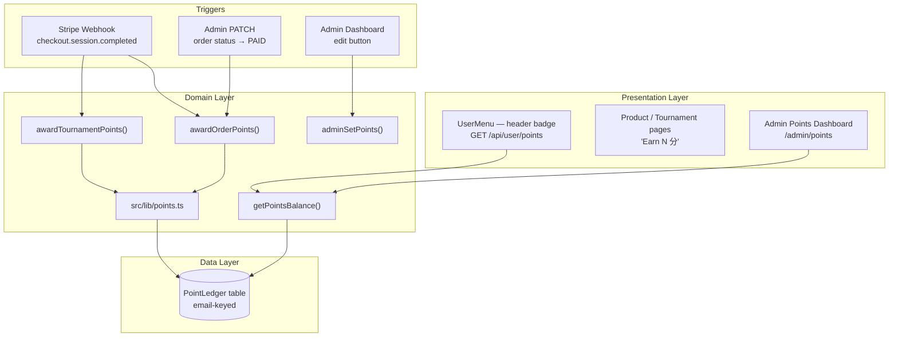

# ADR-004: Points / Loyalty System

| Field | Value |
|-------|-------|
| **Status** | Accepted |
| **Date** | 2026-08-12 |
| **Decision Maker** | Lucas |
| **Related** | ADR-003 (Transaction Management System — future integration point for `referenceId`) |

---

## Context

The TCGHK e-commerce site needs a loyalty points system. Customers earn points from purchases (products and tournaments); admins can adjust points manually. Points are tracked for **all customers**, including guests who checkout without an account. Guests accumulate points but cannot use them until they register.

The current codebase has:

- `User` model (`prisma/schema.prisma:63`) — `email` is `@unique`, no points field
- `Order` model (`:212`) — `userId?` nullable, `email` always present
- `TournamentRegistration` (`:256`) — same pattern: `userId?` nullable, `email` always present
- Auth: JWT strategy (`auth.config.ts`), `jwt` callback adds `id` + `role` to token
- Stripe webhook (`src/app/api/webhooks/stripe/route.ts`) — marks `PENDING → PAID`, sends receipt
- Admin orders page (`src/app/admin/(panel)/orders/page.tsx`) — status dropdown for manual changes
- No existing points/loyalty infrastructure

### Key Architectural Insight

Email is the universal identity for points, not `userId`. This was decided after the user identified a critical edge case: **a guest can check out using an already-registered email** (e.g., Alice has an account but checks out as a guest with the same email). A "temporary guest account" approach would collide with the real account.

Since the site has no change-email feature, the mapping `email → identity` is immutable and 1:1. Points keyed by email are naturally correct regardless of whether the customer is logged in or not. Registration doesn't transfer points — it simply **unlocks** the ability to view and use them.

---

## 3-Layer Separation

| Layer | Responsibility | Concrete Components |
|-------|---------------|---------------------|
| **Presentation** | Display points in header, product pages, checkout, tournament registration, admin dashboard | `user-menu.tsx` (header badge), product/tournament pages, `src/app/admin/(panel)/points/page.tsx` (new) |
| **Domain** | Earning rules, calculation, balance query, admin adjustment, idempotency | `src/lib/points.ts` (new service module) |
| **Data** | Ledger table storing every point transaction | `PointLedger` model in `prisma/schema.prisma` |



---

## Decision 1: Data Model — Ledger-Only, Email-Keyed

**Decision:** Store every point change as a row in a `PointLedger` table keyed by email. Balance is always computed as `SUM(delta) WHERE email = ?`. No denormalized balance field.

```prisma
enum PointReason {
  ORDER_EARN
  TOURNAMENT_EARN
  ADMIN_ADJUST
}

model PointLedger {
  id          String      @id @default(uuid())
  email       String                       // ← universal key (guest or user)
  delta       Int                          // integer points (+10, -5, etc.)
  reason      PointReason
  referenceId String?                      // Order.id, TournamentRegistration.id, or admin user id
  note        String?                      // free-text reason for ADMIN_ADJUST
  createdAt   DateTime    @default(now())

  @@index([email])
  @@index([email, createdAt])
  @@index([referenceId, reason])
}
```

**Balance query:**
```sql
SELECT COALESCE(SUM(delta), 0) AS balance
FROM "PointLedger"
WHERE email = ?
```

### Alternatives Considered

| Option | Pros | Cons | Verdict |
|--------|------|------|---------|
| **A. Ledger-only (chosen)** | Single source of truth, full audit trail, no sync bugs, guest/user unified | Balance read is a SUM query | ✅ |
| B. Ledger + `User.points` denormalized | Fast balance read on User record | Two values to sync, two code paths (guest vs user), drift risk | ❌ |
| C. Ledger + `PointsBalance` table keyed by email | Fast O(1) lookup for any email | Redundant data, dual-write on every change | ❌ |
| D. Separate `GuestPoints` temp account table | Explicit lifecycle for guest points | Two tables for admin query, transfer logic on registration, edge case collision with registered emails | ❌ |

### Context

The user initially proposed a "temporary guest account" for storing guest points. During grilling, they identified that the guest-using-registered-email edge case makes temp accounts messy. They refined the approach to use email as the sole identity — guest-to-user flow becomes "unlocking" points, not transferring them.

### Consequences
- **Positive:** Single source of truth — balance can never drift from reality. Full audit trail for free. Guest and user are identical in the data model. Adding spend later is just a negative `delta` row.
- **Negative:** Balance read is a `SUM` query (acceptable at hundreds of customers; index on `email` makes it fast).
- **Review trigger:** If admin dashboard query becomes slow (>500ms) at >1000 customers, add a denormalized `PointsBalance` cache table.

---

## Decision 2: Earning Calculation — Integer, 1 Point per $1

**Decision:** Points are integers. Earn rate is 1 point per HKD 1 spent, rounded down with `Math.floor(amount)`.

| Order Subtotal | Points Earned |
|----------------|---------------|
| $10.00 | 10 |
| $15.50 | 15 |
| $99.99 | 99 |
| $3.00 | 3 |

### Alternatives Considered

| Option | Pros | Cons | Verdict |
|--------|------|------|---------|
| A. Float, 0.1 per $1 (original spec) | Matches stated rate | Float drift — `9.999` stored as `9.9990000001`, SUM accumulates errors | ❌ |
| **B. Integer, 1 per $1 (chosen)** | Zero precision bugs, clean display, deterministic rounding | Earn rate is 10× original spec — tune redemption value later | ✅ |
| C. Integer centi-points (×10) | Exact 0.1 rate with integer storage | Confusing mental model, conversion layer everywhere | ❌ |

### Context

The user originally specified 0.1 points per dollar. During grilling, they learned that floats in financial calculations cause precision bugs. Since there is no spending mechanism yet, the absolute numbers are arbitrary — what matters is the ratio, which will be defined when redemption is added.

### Consequences
- **Positive:** Zero float precision bugs. Clean integer display everywhere. `SUM(delta)` is always exact.
- **Negative:** Earn rate is higher than originally specified. Redemption value must be tuned accordingly.
- **Review trigger:** If point redemption economics feel off, revisit the rate (data type stays integer regardless).

---

## Decision 3: Earning Amount — Subtotal Only

**Decision:** Points are earned on the order subtotal (sum of item prices), not on shipping. For tournaments, points are earned on the `entryFee`. Free tournaments ($0) earn 0 points — no ledger entry is created.

| Transaction Type | Amount Used | Example |
|-----------------|-------------|---------|
| Product order | `SUM(unitPrice × quantity)` for all OrderItems | $50 items + $30 shipping = 50 points |
| Tournament (paid) | `Tournament.entryFee` | $100 entry fee = 100 points |
| Tournament (free) | $0 | 0 points, no ledger entry |

### Alternatives Considered

| Option | Pros | Cons | Verdict |
|--------|------|------|---------|
| **A. Subtotal only (chosen)** | Points reflect real product value, industry standard | Slightly fewer points for customer | ✅ |
| B. Total (subtotal + shipping) | Customer gets more points | Rewards shipping spend, which is pass-through cost | ❌ |

### Context

Shipping is a pass-through cost to the freight company (順豐), not revenue. Earning points on $30 shipping for a $10 item would inflate rewards artificially.

### Consequences
- **Positive:** Points reflect real commercial value.
- **Negative:** None significant.
- **Review trigger:** If a "participation bonus" concept is added for free tournaments, that's a new `PointReason` (not a change to this decision).

---

## Decision 4: Trigger Architecture — Service Module Inside Transaction

**Decision:** All point-awarding logic lives in a new `src/lib/points.ts` service module. The Stripe webhook and admin status-change handler call this service. The ledger insert is inside the existing Prisma `$transaction` — atomic with the payment status update.

```ts
// src/lib/points.ts

export async function awardOrderPoints(
  email: string,
  orderId: string,
  subtotal: number,
): Promise<void> {
  const points = Math.floor(subtotal);
  if (points <= 0) return;

  // Idempotency: skip if already awarded
  const existing = await prisma.pointLedger.findFirst({
    where: { referenceId: orderId, reason: "ORDER_EARN" },
  });
  if (existing) return;

  await prisma.pointLedger.create({
    data: { email, delta: points, reason: "ORDER_EARN", referenceId: orderId },
  });
}

export async function awardTournamentPoints(
  email: string,
  registrationId: string,
  entryFee: number,
): Promise<void> {
  const points = Math.floor(entryFee);
  if (points <= 0) return;

  const existing = await prisma.pointLedger.findFirst({
    where: { referenceId: registrationId, reason: "TOURNAMENT_EARN" },
  });
  if (existing) return;

  await prisma.pointLedger.create({
    data: { email, delta: points, reason: "TOURNAMENT_EARN", referenceId: registrationId },
  });
}

export async function getPointsBalance(email: string): Promise<number> {
  const result = await prisma.pointLedger.aggregate({
    where: { email },
    _sum: { delta: true },
  });
  return Math.max(0, result._sum.delta ?? 0);
}

export async function adminSetPoints(
  email: string,
  target: number,
  note: string,
  adminId: string,
): Promise<void> {
  const clampedTarget = Math.max(0, target);
  const current = await getPointsBalance(email);
  const delta = clampedTarget - current;
  if (delta === 0) return;

  await prisma.pointLedger.create({
    data: { email, delta, reason: "ADMIN_ADJUST", referenceId: adminId, note },
  });
}
```

**Webhook integration:**
```ts
// src/app/api/webhooks/stripe/route.ts
if (order && order.status === "PENDING") {
  const subtotal = order.items.reduce((s, i) => s + i.unitPrice * i.quantity, 0);
  await prisma.$transaction([
    prisma.order.update({ where: { id: order.id }, data: { status: "PAID" } }),
    ...stock decrements,
  ]);
  // ← Award points AFTER transaction succeeds
  await awardOrderPoints(order.email, order.id, subtotal);
}
```

### Alternatives Considered

| Option | Pros | Cons | Verdict |
|--------|------|------|---------|
| A. Inline in webhook | Fewest files | Mixes route handling with domain logic, duplicates calculation | ❌ |
| **B. Service module `src/lib/points.ts` (chosen)** | Clean 3-layer separation, testable, follows existing patterns (`email.ts`, `stripe.ts`) | One extra file | ✅ |
| C. Prisma extension auto-trigger | Zero code in webhook | Magic side effects, implicit triggers on every `order.update`, dangerous for financial logic | ❌ |

### Context

The user practices 3-layer separation. The existing codebase has service modules for each domain (`email.ts`, `stripe.ts`, `checkout.ts`). `points.ts` follows the same pattern. The service is called from the Stripe webhook (automatic payment) and from the admin status-change API (manual/offline payment).

### Consequences
- **Positive:** Clean separation, testable in isolation, consistent with codebase patterns.
- **Negative:** One extra file.
- **Review trigger:** If a third earning trigger is added (e.g., referral bonus), the service module pattern already supports it.

---

## Decision 5: Manual Admin PAID Also Awards Points (With Idempotency Guard)

**Decision:** When admin manually changes an order status to PAID (offline payments: bank transfer, cash, in-store), points are also awarded. The service function checks for an existing ledger entry before inserting, preventing double-awards.

```ts
// Inside awardOrderPoints():
const existing = await prisma.pointLedger.findFirst({
  where: { referenceId: orderId, reason: "ORDER_EARN" },
});
if (existing) return;  // Already awarded — skip
```

### Alternatives Considered

| Option | Pros | Cons | Verdict |
|--------|------|------|---------|
| A. Yes, always award on PAID | Consistent, fair for offline payments | Double-award risk if status is toggled | ❌ (without guard) |
| B. No, only Stripe webhook awards | One trigger point, no double-award risk | Offline payments earn no points — unfair | ❌ |
| **C. Yes, with idempotency guard (chosen)** | Both paths award, double-award impossible | Extra query per award (negligible) | ✅ |

### Context

The admin orders page has a status dropdown — admin can set orders to PAID for non-Stripe payments. Offline payments are real (bank transfer, in-store pickup). Excluding them from earning points would be unfair.

### Consequences
- **Positive:** Offline payments earn points fairly. Double-award impossible. Handles webhook retry edge case.
- **Negative:** Extra `findFirst` query per award call (negligible cost).
- **Review trigger:** If award frequency becomes high (bulk operations), batch the idempotency check.

---

## Decision 6: Header Display — Client-Side Fetch with Loading Animation

**Decision:** The `UserMenu` component (`user-menu.tsx`) fetches the current balance from a new `GET /api/user/points` endpoint. A loading skeleton/animation shows while fetching to avoid a flash of "0".

```tsx
// user-menu.tsx — conceptual
const { data: session } = useSession();
const [points, setPoints] = useState<number | null>(null);
const [loading, setLoading] = useState(true);

useEffect(() => {
  if (!session?.user) return;
  fetch("/api/user/points")
    .then((r) => r.json())
    .then((d) => setPoints(d.points))
    .finally(() => setLoading(false));
}, [session]);

// Render:
{loading ? <Skeleton /> : <Badge>{points} 分</Badge>}
```

```ts
// GET /api/user/points
export async function GET() {
  const session = await auth();
  if (!session?.user?.email) return NextResponse.json({ error: "Unauthorized" }, { status: 401 });
  const balance = await getPointsBalance(session.user.email);
  return NextResponse.json({ points: balance });
}
```

### Alternatives Considered

| Option | Pros | Cons | Verdict |
|--------|------|------|---------|
| A. Add `points` to JWT token | Zero extra requests | **Stale** until re-login, adds points logic to auth config | ❌ |
| **B. Client-side fetch (chosen)** | Always fresh, auth stays clean, consistent with cart pattern | One extra request per page load (mitigated by loading animation) | ✅ |
| C. JWT with periodic refresh | Mostly fresh | DB query on every session access via `jwt` callback, complex | ❌ |

### Context

The `UserMenu` component already uses `useSession()` (client-side). Adding a `useEffect` fetch follows the same pattern as `CartProvider`. Auth config stays simple — only `id` and `role` in the JWT.

### Consequences
- **Positive:** Always-fresh balance, clean auth config, consistent with existing client-side patterns.
- **Negative:** One extra network request per page load.
- **Review trigger:** If header load time becomes noticeable, add SWR caching with 60s revalidation.

---

## Decision 7: Admin Adjustment — Absolute Set with Required Reason

**Decision:** Admin clicks edit, types the target balance (e.g., "60"), and must provide a reason note. The service computes `delta = target - current` and inserts one ledger entry.

```
┌─────────────────────────────────────┐
│  Adjust Points — alice@test.com     │
│                                     │
│  Current Balance: 45                │
│  New Balance:  [ 60      ]          │
│  Reason:       [ Compensation for   │
│                  damaged card      ] │
│                                     │
│  Delta: +15                         │
│                                     │
│  [ Cancel ]  [ Save ]               │
└─────────────────────────────────────┘
```

```ts
// adminSetPoints() in src/lib/points.ts
const clampedTarget = Math.max(0, target);
const current = await getPointsBalance(email);
const delta = clampedTarget - current;
if (delta === 0) return;

await prisma.pointLedger.create({
  data: { email, delta, reason: "ADMIN_ADJUST", referenceId: adminId, note },
});
```

### Alternatives Considered

| Option | Pros | Cons | Verdict |
|--------|------|------|---------|
| A. Absolute set, no reason | Matches admin mental model | No audit trail for *why* the change was made | ❌ |
| B. Relative adjust (add/subtract delta) | One query, atomic | Admin must calculate delta manually, error-prone | ❌ |
| **C. Absolute set + required reason (chosen)** | Best UX, mandatory audit trail | Two queries (read current, write delta) | ✅ |

### Context

Admins think in target numbers ("Alice should have 200 points"), not deltas ("add 27"). The reason field ensures every manual change is traceable. The two-query race window is negligible — admin adjustments are rare manual operations.

**Recommendation (not explicitly confirmed):** The edit dialog should show the customer's recent point history inline, so the admin can verify the adjustment makes sense before saving.

### Consequences
- **Positive:** Intuitive admin UX, mandatory audit trail with reason note.
- **Negative:** Two-query read-then-write (negligible at admin operation frequency).
- **Review trigger:** If admin adjustments become frequent (bulk operations), add atomic relative-adjust mode.

---

## Decision 8: Points Display on Pages — Context-Aware for Guests

**Decision:** Product pages, checkout, and tournament registration show potential points to all visitors. Logged-in users see "Earn N 分." Guests see "Earn N 分 — register to view & use them."

| User State | Product Page | Checkout | Tournament |
|------------|-------------|----------|------------|
| Logged in | "Earn 50 分" | "You will earn 50 分" | "Earn 30 分" |
| Guest | "Earn 50 分" | "You will earn 50 分 — register to view & use them" | "Earn 30 分 — register to view & use them" |

Calculation is client-side: `Math.floor(price)` for products, `Math.floor(entryFee)` for tournaments. No API call needed.

**Checkout success page for guests** shows a prominent CTA: "🎉 You earned N points! Create an account with [their email] to view and use them."

### Alternatives Considered

| Option | Pros | Cons | Verdict |
|--------|------|------|---------|
| A. Identical for everyone | Simple, one message | Guest doesn't know how to access points | ❌ |
| **B. Context-aware (chosen)** | Registration incentive, honest about guest points | Two conditional paths per component | ✅ |
| C. Hide for guests | Simplest | Violates requirement (guests earn points), misses registration opportunity | ❌ |

### Context

Guests accumulate points by design (Decision 1). Showing them that they're earning — and how to access them — is transparent and drives registration. The guest checkout success page is a prime conversion point.

### Consequences
- **Positive:** Registration incentive, transparent experience, no dark patterns.
- **Negative:** Slightly more complex UI logic (conditional messaging).
- **Review trigger:** If registration conversion from guests is low, make the CTA more prominent.

---

## Decision 9: Admin Search — Name OR Email

**Decision:** Single search box on the admin dashboard. Query matches against `User.name` OR `email` (case-insensitive ILIKE). Filter dropdown for user/guest type.

```sql
SELECT p.email, COALESCE(SUM(p.delta), 0) AS balance,
       u.name,
       CASE WHEN u.id IS NOT NULL THEN 'USER' ELSE 'GUEST' END AS type
FROM "PointLedger" p
LEFT JOIN "User" u ON u.email = p.email
WHERE (:search = '' OR u.name ILIKE '%' || :search || '%' OR p.email ILIKE '%' || :search || '%')
GROUP BY p.email, u.name, u.id
```

### Alternatives Considered

| Option | Pros | Cons | Verdict |
|--------|------|------|---------|
| A. Name only | Matches original spec | Guests unsearchable (no name) | ❌ |
| B. Email only | Works for everyone | Admin who knows name but not email can't search | ❌ |
| **C. Name OR email (chosen)** | Flexible, standard admin UX | Two ILIKE conditions | ✅ |

### Context

Guests have no name — only email. A name-only search would make guests invisible. One search box matching both fields is the standard pattern (Shopify, Stripe).

### Consequences
- **Positive:** Admin can search by whatever they know — name, email, or partial.
- **Negative:** Slightly more complex query.
- **Review trigger:** None — this is the correct approach.

---

## Decision 10: Balance Floor at 0

**Decision:** Displayed balance is clamped to `Math.max(0, SUM(delta))`. Points can never appear negative to users or admins. The ledger itself is never modified to clamp — the floor is applied at the query/display level.

```ts
export async function getPointsBalance(email: string): Promise<number> {
  const result = await prisma.pointLedger.aggregate({
    where: { email },
    _sum: { delta: true },
  });
  return Math.max(0, result._sum.delta ?? 0);
}
```

### Alternatives Considered

| Option | Pros | Cons | Verdict |
|--------|------|------|---------|
| **A. Floor at 0 (chosen)** | Points make sense to customers | Slight mismatch between raw SUM and displayed balance | ✅ |
| B. Allow negative | SUM always matches display | Negative points confuse customers | ❌ |

### Context

There is no spending mechanism yet, so the only way to get negative is admin setting below 0. Negative points are meaningless to a customer. The admin "set to target" function also clamps: `Math.max(0, target)`.

### Consequences
- **Positive:** Customer-facing balance is always sensible.
- **Negative:** Raw ledger SUM can differ from displayed balance (audit purposes still use raw SUM).
- **Review trigger:** If point spending is added and "debt" becomes a concept, revisit whether negative balances are needed.

---

## Decision 11: Admin Dashboard — Rank by Points

**Decision:** The admin dashboard includes a sort/rank feature. Admin can sort by points balance (descending by default, showing highest-value customers first). This is in addition to the search (Decision 9) and user/guest filter.

Dashboard columns:

| Column | Source |
|--------|--------|
| Rank | Computed (row number in sorted order) |
| Email | `PointLedger.email` |
| Name | `User.name` (via LEFT JOIN, null for guests — display email) |
| Type | `USER` if User exists, else `GUEST` |
| Points Balance | `SUM(delta)` floored at 0 |
| Last Earned | `MAX(createdAt)` from ledger for that email |
| Actions | Edit button → opens adjustment dialog (Decision 7) |

### Consequences
- **Positive:** Admin can identify top customers at a glance.
- **Negative:** None significant.
- **Review trigger:** None.

---

## Consequence Summary

### Schema Changes Required

| Change | Type | Risk |
|--------|------|------|
| `PointLedger` model | New table | Low — additive |
| `PointReason` enum | New enum | Low — additive |
| `note` field on `PointLedger` | New nullable column | Low — nullable |

No changes to existing `User`, `Order`, or `TournamentRegistration` models.

**Migration SQL** (must be run manually via `pg.Pool` — `prisma migrate deploy` fails with P3005 on this DB):

```sql
CREATE TYPE "PointReason" AS ENUM ('ORDER_EARN', 'TOURNAMENT_EARN', 'ADMIN_ADJUST');

CREATE TABLE "PointLedger" (
  "id" TEXT PRIMARY KEY DEFAULT gen_random_uuid()::text,
  "email" TEXT NOT NULL,
  "delta" INTEGER NOT NULL,
  "reason" "PointReason" NOT NULL,
  "referenceId" TEXT,
  "note" TEXT,
  "createdAt" TIMESTAMP(3) NOT NULL DEFAULT CURRENT_TIMESTAMP
);

CREATE INDEX "PointLedger_email_idx" ON "PointLedger"("email");
CREATE INDEX "PointLedger_email_createdAt_idx" ON "PointLedger"("email", "createdAt");
CREATE INDEX "PointLedger_referenceId_reason_idx" ON "PointLedger"("referenceId", "reason");
```

### New API Endpoints

| Endpoint | Method | Purpose |
|----------|--------|---------|
| `/api/user/points` | GET | Current user's balance (for header display) |
| `/api/admin/points` | GET | List all accounts with balances (admin dashboard) |
| `/api/admin/points` | PATCH | Admin adjust points (absolute set + reason) |

### New UI Pages / Components

| Component | Location | Purpose |
|-----------|----------|---------|
| Points badge in header | `src/components/layout/user-menu.tsx` (modified) | Show balance next to username |
| Points indicator on product | Product detail page (modified) | "Earn N 分" |
| Points indicator on tournament | Tournament register page (modified) | "Earn N 分" |
| Points indicator on checkout | Checkout page (modified) | "You will earn N 分" |
| Admin points dashboard | `src/app/admin/(panel)/points/page.tsx` (new) | Table with search, filter, sort, edit |
| Admin edit dialog | Inside admin points page | Absolute-set adjustment with reason |

### New Library Module

| Module | Path | Exports |
|--------|------|---------|
| Points service | `src/lib/points.ts` | `awardOrderPoints()`, `awardTournamentPoints()`, `getPointsBalance()`, `adminSetPoints()` |

### Modified Files (Existing)

| File | Change |
|------|--------|
| `src/app/api/webhooks/stripe/route.ts` | Call `awardOrderPoints()` / `awardTournamentPoints()` after PAID |
| `src/app/api/admin/orders/[id]/route.ts` | Call `awardOrderPoints()` on manual PAID transition |
| `src/components/layout/user-menu.tsx` | Add points badge with fetch + loading animation |
| `src/components/admin/admin-sidebar.tsx` | Add "積分管理" nav item |
| `src/app/about/page.tsx` (or `AboutPageContent` data) | Add points system description section |
| `prisma/schema.prisma` | Add `PointLedger` model + `PointReason` enum |

---

## Review Triggers

| Condition | Revisit Decision |
|------------|-----------------|
| Admin dashboard query > 500ms at >1000 customers | Decision 1 — add denormalized balance cache |
| Point redemption economics feel off | Decision 2 — adjust earn rate (keep integer type) |
| Free tournament participation bonus desired | Decision 3 — add new `PointReason` |
| Third earning trigger added (referral, etc.) | Decision 4 — service module already supports it |
| Bulk admin point operations needed | Decision 5 — batch idempotency check |
| Header load time noticeable | Decision 6 — add SWR caching with 60s revalidation |
| Frequent admin adjustments causing races | Decision 7 — add atomic relative-adjust mode |
| Low guest registration conversion | Decision 8 — make CTA more prominent |
| Point spending "debt" concept needed | Decision 10 — revisit negative balances |

---

## 3-Layer Separation: Assessment

The user's 3-layer separation is well-applied in this design:

| Layer | Correct | Notes |
|-------|---------|-------|
| **Presentation** | ✅ | UI components fetch data via API, display points. No business logic in components. Product/tournament pages compute `Math.floor(price)` client-side — this is presentation formatting, not domain logic (the *rule* "1 point per $1" lives in `points.ts`). |
| **Domain** | ✅ | `src/lib/points.ts` encapsulates all earning rules, calculation, idempotency, and admin adjustment. Triggers (webhook, admin handler) call the domain service — they don't implement logic. |
| **Data** | ✅ | `PointLedger` table is a pure append-only event log. No denormalized state. Balance is derived, not stored. This is the canonical event-sourced pattern for financial data. |

**Key architectural insight:** The ledger-only model is a lightweight form of **event sourcing**. Each row is an event (earn, adjust, future spend). The balance is a projection (SUM). This is more robust than CRUD-style state mutation and aligns naturally with the audit-trail requirement.

**One layer violation to watch:** The product/tournament pages compute `Math.floor(price)` client-side for the "Earn N 分" display. This is acceptable because it's a read-only projection — the authoritative calculation happens server-side in `awardOrderPoints()`. If the rate changes, both the server function and the client display must be updated. Consider extracting the rate into a shared constant (`POINTS_RATE = 1`) imported by both.
