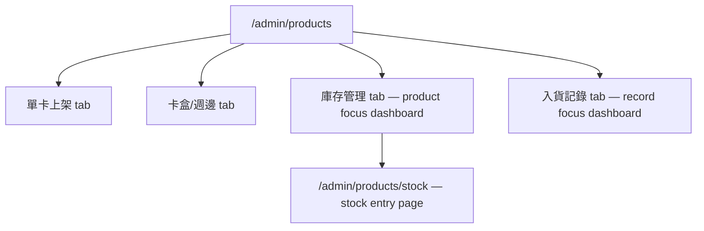
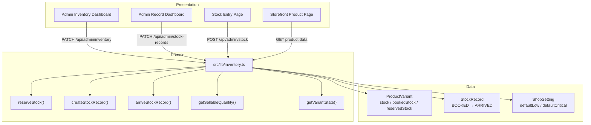

# ADR-005: Inventory Stocking System

| Field | Value |
|-------|-------|
| **Status** | Accepted |
| **Date** | 2026-08-14 |
| **Decision Maker** | Lucas |
| **Related** | ADR-003 (Transaction Management), ADR-004 (Points System) |

---

## Context

The TCGHK shop currently tracks inventory as a single `stock: Int` field on `ProductVariant` (in `prisma/schema.prisma`). This field is decremented by the Stripe webhook on purchase (`src/app/api/webhooks/stripe/route.ts`) and checked at checkout (`src/app/api/checkout/route.ts`). The admin products page (`src/components/admin/products-table.tsx`) allows inline editing of this number.

This single-number model has several problems:a

1. **No incoming stock tracking.** When the shop orders from a supplier, there's no record of what's incoming or when it arrives. Admin just manually bumps the number when stock physically arrives — error-prone and unauditable.
2. **No reservation system.** Walk-in customers and tournament organizers ask the shop to hold items. There's no way to mark items as "held" vs "sellable." Reserved items look identical to available stock.
3. **No walk-in buffer.** Online customers can buy the last copy, leaving nothing for walk-in customers who may have traveled to the physical store.
4. **No stock state visibility.** Admin can't see at a glance which products are critically low and need reordering.

This ADR defines a full inventory stocking system with booked/reserved quantities, state thresholds, a buffer zone for walk-in priority, and two dashboards (product focus + record focus).

---

## 3-Layer Separation

The user proposed a 3-layer separation. The mapping is assessed at the end of this document after all decisions are resolved.

| Layer | Components |
|-------|------------|
| **Presentation** | Admin inventory dashboard (`/admin/products` tabs), stock entry page (`/admin/products/stock`), storefront product page + checkout changes |
| **Domain** | `src/lib/inventory.ts` — reserve, un-reserve, stock, arrive, manual adjust, state calculation, sellable quantity |
| **Data** | `ProductVariant` (extended), `StockRecord` (new), `ShopSetting` (new) |

---

## Decision 1: Stock Granularity — Hybrid (Data on Variant, Dashboard Groups by Product)

**Decision:** Stock tracking stays on `ProductVariant` (where it already lives as `stock`). The inventory dashboard groups variants under their parent product for readability, but all operations act on individual variants.

### Alternatives Considered

| Option | Pros | Cons | Verdict |
|--------|------|------|---------|
| **A. Hybrid (chosen)** | No checkout rewrite; preserves variant pricing; no data loss | Dashboard needs variant rows under each product | ✅ |
| B. Flatten to Product-level | Simpler dashboard | Breaks checkout (operates per-variant); loses condition-specific stock | ❌ |
| C. Variant-level dashboard only | Technically simplest | Harder to read — no product grouping | ❌ |

### Context

The user's description talks about "product quantity" as a single number. However, the codebase already has `ProductVariant.stock` — a product like "Pikachu ex" can have multiple variants (Near Mint, Lightly Played, Foil), each with independent stock. Checkout (`src/app/api/checkout/route.ts`) and the Stripe webhook (`src/app/api/webhooks/stripe/route.ts`) both operate per-variant. Flattening to product-level would break this.

### Consequences
- **Positive:** No checkout/webhook rewrite; variant pricing preserved; existing data untouched
- **Negative:** Dashboard UI must show variant-level rows grouped under products
- **Review trigger:** If products simplify to single-variant (e.g., sealed products), revisit flat model

---

## Decision 2: Data Model — Add Denormalized Counters to ProductVariant

**Decision:** Keep the existing `stock` field (semantically "actual"). Add `bookedStock` and `reservedStock` as denormalized counters. Add `reservedNote` for optional context.

```prisma
model ProductVariant {
  // ... existing fields unchanged ...
  stock          Int     @default(0)    // ACTUAL: in the shop, sellable (field name unchanged)
  bookedStock    Int     @default(0)    // NEW: incoming shipments not yet arrived
  reservedStock  Int     @default(0)    // NEW: held for walk-ins/tournaments, not for sale
  reservedNote   String?                // NEW: optional free-text ("2 for Mr. Chan, 1 for tournament")
  lowThreshold       Int?               // NEW: per-variant override (null = use global)
  criticalThreshold  Int?               // NEW: per-variant override (null = use global)
}
```

The formula: **total = actual + booked + reserved**.

### Alternatives Considered

| Option | Pros | Cons | Verdict |
|--------|------|------|---------|
| **A. Denormalized counters (chosen)** | Fast queries; no joins; simple migration (add columns with defaults) | Counters must stay in sync with StockRecord table | ✅ |
| B. Derive booked from StockRecord | Single source of truth; no drift | Every query needs join + aggregate; slower | ❌ |
| C. Full append-only ledger | Complete audit trail | Massive refactor; overkill for small catalog | ❌ |

### Context

Checkout already checks `variant.stock` and the webhook decrements it. Keeping `stock` as "actual" means checkout code barely changes. The denormalized `bookedStock` counter is maintained in sync: incremented when a StockRecord is created, decremented when toggled to arrived.

### Consequences
- **Positive:** Minimal checkout changes; fast queries; simple backward-compatible migration
- **Negative:** `bookedStock` could drift from `SUM(StockRecord.quantity WHERE state = BOOKED)` if bugs occur
- **Review trigger:** If counters drift, add a reconciliation script or cron job

---

## Decision 3: Reserved — Counter Only, No Individual Records

**Decision:** Reserved is a simple counter on `ProductVariant` with an optional `reservedNote`. No separate `ReservedRecord` table. Admin clicks "+" to reserve, uses an edit button to decrease or clear.

### Reserve Flow (priority: actual first, then booked)

```
reserve(N):
  fromActual = min(N, stock)          // actual = "stock" field
  fromBooked = min(N - fromActual, bookedStock)
  if fromActual + fromBooked < N:
    ERROR "cannot reserve, only {stock + bookedStock} available"
  stock         -= fromActual
  bookedStock   -= fromBooked
  reservedStock += N
```

### Un-reserve Flow (always returns to actual)

```
unreserve(N):
  release = min(N, reservedStock)
  reservedStock -= release
  stock         += release
```

> **Known edge case:** If items were reserved from booked (before arrival) and then un-reserved, they return to actual. This temporarily inflates actual because the items haven't physically arrived yet. Admin should verify quantities after un-reserving in this scenario. This is acceptable for a small shop where reserving from booked is rare.

### Alternatives Considered

| Option | Pros | Cons | Verdict |
|--------|------|------|---------|
| **A. Counter + note (chosen)** | Minimal UI; fast; matches dashboard template | Can't release individual holds; no per-reservation audit | ✅ |
| B. Individual ReservedRecord entries | Full audit trail; individual release | Extra table + complex UI | ❌ |

### Context

The user explicitly wanted to avoid UI complexity. Reservations are typically small-scale and short-lived (walk-in holds, tournament allocations). The `reservedNote` field provides enough context for the admin.

### Consequences
- **Positive:** Dead-simple UI; no extra table; fast to operate
- **Negative:** No individual reservation tracking; un-reserve from booked has edge case (see above)
- **Review trigger:** If disputes arise over who reserved what, add a `ReservedRecord` table

---

## Decision 4: StockRecord — Flat Table, One Variant Per Record

**Decision:** A new `StockRecord` table with one row per variant per stocking event. Each record tracks quantity, unit cost, state (BOOKED/ARRIVED), timestamps, and optional arrival note.

```prisma
enum StockState {
  BOOKED
  ARRIVED
}

model StockRecord {
  id          String     @id @default(uuid())
  variantId   String
  variant     ProductVariant @relation(fields: [variantId], references: [id], onDelete: Cascade)
  quantity    Int
  unitCost    Float                       // cost price (what shop paid per unit)
  state       StockState @default(BOOKED)
  bookedAt    DateTime   @default(now())
  arrivedAt   DateTime?
  arrivalNote String?

  @@index([variantId])
  @@index([state])
}
```

### Alternatives Considered

| Option | Pros | Cons | Verdict |
|--------|------|------|---------|
| **A. Flat table, one variant per record (chosen)** | Simple; self-contained; matches "choose the product" flow | Multi-product shipments require multiple form submissions | ✅ |
| B. StockOrder parent with line items | Groups a supplier shipment | Extra parent table; complex UI | ❌ |

### Context

The user's stock page description: "choose the product that being stocked and the number and the price of this single stocking." This is one variant at a time. For a TCG shop with a manageable catalog, submitting 5 times for a 5-product shipment is acceptable.

`unitCost` is the **cost price** (what the shop paid the supplier), not the selling price. It's for internal accounting/profit reference. It does NOT update `ProductVariant.price`.

### Consequences
- **Positive:** Simple schema; simple UI; self-contained records; cost tracking for profit analysis
- **Negative:** Repetitive for multi-product shipments
- **Review trigger:** If stocking 10+ products per shipment becomes painful, add a `StockOrder` parent table

---

## Decision 5: State Thresholds — Global Defaults with Per-Variant Override

**Decision:** Global thresholds live in a new `ShopSetting` singleton table. Each variant can override with nullable `lowThreshold` and `criticalThreshold` fields (null = use global default).

```prisma
model ShopSetting {
  id                      String   @id @default("default")
  defaultLowThreshold     Int      @default(5)
  defaultCriticalThreshold Int     @default(2)
  updatedAt               DateTime @updatedAt
}
```

### State Calculation (based on actual quantity only)

```
effectiveLow(variant)      = variant.lowThreshold ?? shopSetting.defaultLowThreshold
effectiveCritical(variant) = variant.criticalThreshold ?? shopSetting.defaultCriticalThreshold

if actual > effectiveLow:        → healthy
if effectiveCritical <= actual <= effectiveLow:  → low
if actual < effectiveCritical:   → critical
```

Example with defaults (low=5, critical=2):

| actual | State |
|--------|-------|
| 12 | healthy |
| 6 | low |
| 3 | low |
| 2 | critical |
| 0 | critical |

Dashboard is ranked: **critical → low → healthy** (most urgent first).

### Alternatives Considered

| Option | Pros | Cons | Verdict |
|--------|------|------|---------|
| **A. Global defaults + per-variant override (chosen)** | Sensible defaults; fine-tune expensive items individually | Slightly more fields; need settings UI | ✅ |
| B. Per-variant only | Full control | Tedious; no sensible default for new products | ❌ |
| C. Global only | Simplest | A HK$10 booster and HK$2000 promo card shouldn't share thresholds | ❌ |

### Context

The user said "the setting should also be shown on product upload page." The product upload forms (`ManualSingleForm`, `SealedAccessoryForm`) will include optional threshold fields. When left blank, the variant uses global defaults. The global defaults can be changed via an admin settings section without code deployment.

### Consequences
- **Positive:** Flexible; sensible defaults; no code deploys to change thresholds
- **Negative:** New `ShopSetting` table + small settings UI
- **Review trigger:** If thresholds rarely vary per product, simplify to global-only

---

## Decision 6: Customer-Facing Quantity — Buffer Zone (actual − criticalThreshold)

**Decision:** The online sellable quantity is `actual − effectiveCriticalThreshold`. This creates a **buffer zone** that prioritizes walk-in customers. Products are hidden from the online store when the sellable quantity reaches 0 (i.e., actual ≤ criticalThreshold).

```
sellableQuantity = max(0, actual - effectiveCriticalThreshold)

if sellableQuantity <= 0:  → hide product from storefront
```

| actual | criticalThreshold | Online shows | Visible? | State |
|--------|-------------------|-------------|----------|-------|
| 12 | 5 | 7 | ✅ | healthy |
| 7 | 5 | 2 | ✅ | low |
| 6 | 5 | 1 | ✅ | low |
| 5 | 5 | 0 | ❌ hidden | low→critical edge |
| 3 | 5 | — | ❌ hidden | critical |

### Changes Required

**Product page (storefront):**
- Display `sellableQuantity` instead of raw `actual`
- Hide product entirely when `sellableQuantity <= 0`

**Checkout (`src/app/api/checkout/route.ts`):**
- Current: `if (variant.stock < item.quantity) { throw }`
- New: `const sellable = variant.stock - effectiveCriticalThreshold; if (sellable < item.quantity) { throw }`

**Stripe webhook (`src/app/api/webhooks/stripe/route.ts`):**
- Unchanged — still decrements `stock` (actual) by `item.quantity`

### Alternatives Considered

| Option | Pros | Cons | Verdict |
|--------|------|------|---------|
| **A. Buffer zone: actual − criticalThreshold (chosen)** | Protects walk-in stock; simple formula | Online customers see fewer items than physically in shop | ✅ |
| B. Show actual only (no buffer) | Maximizes online sales | Walk-in customers get nothing | ❌ |
| C. Show actual + booked | Informs customers of incoming stock | Misleading — can't buy booked items | ❌ |

### Context

The user explained: "say product A has critical number of 5 and actual quantity is 6, then user should see 1 online. If actual is changed to 5, then A is hidden from online. This is a buffer zone and prioritizing walking user."

Reserved items are already subtracted from actual during the reserve transfer (actual→reserved), so they're naturally excluded from the sellable quantity.

### Consequences
- **Positive:** Walk-in customers always have buffer stock; prevents online overselling; simple formula
- **Negative:** Online customers see fewer items; checkout query needs threshold lookup (adds a join or config fetch)
- **Review trigger:** If walk-in volume drops or online becomes primary channel, reduce/remove the buffer

---

## Decision 7: Stock Arrival — One-Way Toggle, No Revert

**Decision:** StockRecord state transitions from `BOOKED → ARRIVED` only. The toggle requires a form with arrival time and optional remark. On toggle: `bookedStock -= quantity`, `stock += quantity`, fill `arrivedAt` and `arrivalNote`.

```
arrive(recordId, arrivedAt, note?):
  record.state      = ARRIVED
  record.arrivedAt  = arrivedAt
  record.arrivalNote = note
  variant.bookedStock -= record.quantity
  variant.stock       += record.quantity
```

No partial delivery handling — the full booked quantity is assumed to arrive.

### Alternatives Considered

| Option | Pros | Cons | Verdict |
|--------|------|------|---------|
| **A. One-way toggle, full quantity (chosen)** | Simple; audit-friendly | Admin must manually fix mistakes via decrease button | ✅ |
| B. Allow revert (arrived → booked) | Forgiving | Complex reverse-transfer; could cause negative stock if items sold | ❌ |
| C. Partial delivery support | Handles back-orders | More complex form; rare scenario | ❌ |

### Context

The user's record dashboard: "the only action is to toggle the state button from arriving to arrived." For mistakes, admin uses the manual decrease button on the product dashboard. Partial deliveries are assumed not to happen for now.

### Consequences
- **Positive:** Simple state machine; no reverse-transfer logic; record dashboard is read-only after arrival
- **Negative:** No partial delivery; mistakes need manual correction
- **Review trigger:** If partial deliveries happen frequently, add "quantity received" field to arrival form

---

## Decision 8: Dashboard Placement — Replace Old Table Tab + Add Record Tab

**Decision:** The inventory dashboard replaces the existing "已上架商品" tab on `/admin/products`. A new "入貨記錄" tab is added for the record dashboard. Upload forms (單卡上架, 卡盒/週邊) remain unchanged.



### Product Focus Dashboard (replaces ProductsTable)

| name | detail | actual qty ↑↓ | booked qty + | reserve + | total | state | delete |
|------|--------|--------------|-------------|-----------|-------|-------|--------|
| Pikachu ex (NM) | [詳情] | 6 ↑↓ | 5 | 2 (+) | 13 | low | 🗑 |
| Charizard (LP) | [詳情] | 1 ↑↓ | 0 | 0 | 1 | critical | 🗑 |

- **Actual**: ↑ increases, ↓ decreases (direct counter update)
- **Booked**: "+" opens the stock entry page at `/admin/products/stock`
- **Reserve**: "+" opens a small input to reserve quantity
- **Total**: computed (actual + booked + reserved)
- **State**: color-coded badge (critical=red, low=amber, healthy=green); click to open threshold settings
- **Detail**: opens variant detail (same as current edit modal, but quantity fields are view-only)
- **Delete**: hard-deletes the product (with warning dialog)
- Ranking: critical → low → healthy
- Filters: existing (type, setCode, rarityTier) + state filter (critical/low/healthy) + search

### Record Focus Dashboard

| product name | quantity | booked at | state | arrived at |
|-------------|----------|-----------|-------|------------|
| Pikachu ex (NM) | 5 | 2026-08-10 | arrived | 2026-08-13 |
| Charizard (LP) | 3 | 2026-08-14 | arriving | — |

- Toggle arriving → arrived (opens form: arrival time + optional remark)
- View-only product details
- Filters: search (product name) + state filter (arriving/arrived)

### Alternatives Considered

| Option | Pros | Cons | Verdict |
|--------|------|------|---------|
| **A. Tabs on existing products page (chosen)** | No sidebar changes; upload flow preserved; single URL | Page has 4 tabs | ✅ |
| B. New sidebar items | Clean separation | More navigation | ❌ |
| C. Replace entire page | Simplest | Loses upload forms | ❌ |

### Context

The user said "this is meant to rework the product dashboard." The upload forms should stay — stocking is for existing products only. Keeping everything on one page minimizes navigation.

### Consequences
- **Positive:** No sidebar changes; existing upload preserved; all inventory in one place
- **Negative:** Products page has 4 tabs (manageable for admin)
- **Review trigger:** If page gets too cluttered, split into separate routes

---

## Decision 9: Manual Operations — No Audit Trail

**Decision:** Manual stock adjustments (increase, decrease, reserve, un-reserve) directly update the `ProductVariant` counters. No `StockLog` or movement history table.

```typescript
// PATCH /api/admin/inventory/[variantId]
// { action: "increase" | "decrease" | "reserve" | "unreserve" | "clearReserved", quantity?: N }
// → directly modifies ProductVariant fields
```

The `StockRecord` table provides the only audit trail (for booked → arrived). Manual adjustments are corrections/quick edits with no recorded reason.

### Alternatives Considered

| Option | Pros | Cons | Verdict |
|--------|------|------|---------|
| **A. No audit trail (chosen)** | Simple; fast; no friction | Can't trace discrepancies | ✅ |
| B. StockLog table for all movements | Full history | Extra table + friction (reason field) | ❌ |

### Context

The user explicitly wanted to avoid UI complexity. Manual adjustments are infrequent corrections. If discrepancies become recurring, a log can be added later without changing the counter approach.

### Consequences
- **Positive:** Zero friction; minimal code; no extra table
- **Negative:** No accountability trail for manual changes
- **Review trigger:** If stock counts are frequently wrong with no explanation, add a `StockLog` table

---

## Consequence Summary

### Schema Changes Required

| Change | Type | Risk |
|--------|------|------|
| `ProductVariant.bookedStock Int @default(0)` | ADD COLUMN | Low — default 0, no data migration |
| `ProductVariant.reservedStock Int @default(0)` | ADD COLUMN | Low — default 0 |
| `ProductVariant.reservedNote String?` | ADD COLUMN | Low — nullable |
| `ProductVariant.lowThreshold Int?` | ADD COLUMN | Low — nullable, falls back to global |
| `ProductVariant.criticalThreshold Int?` | ADD COLUMN | Low — nullable, falls back to global |
| `StockRecord` table | CREATE TABLE | Low — new table |
| `StockState` enum | CREATE TYPE | Low — new enum |
| `ShopSetting` table | CREATE TABLE | Low — singleton, seed with defaults |
| `ProductVariant.stockRecords` relation | ADD RELATION | Low — new relation |

### New API Endpoints

| Endpoint | Method | Purpose |
|----------|--------|---------|
| `/api/admin/inventory` | GET | List variants with stock data, grouped by product, filtered + ranked by state |
| `/api/admin/inventory/[variantId]` | PATCH | Manual adjust: increase/decrease/reserve/unreserve/clearReserved |
| `/api/admin/stock` | POST | Create StockRecord (stock button → stock entry page) |
| `/api/admin/stock-records` | GET | List StockRecords (record dashboard) |
| `/api/admin/stock-records/[id]` | PATCH | Toggle arrived (booked → arrived) |
| `/api/admin/shop-settings` | GET | Get global threshold defaults |
| `/api/admin/shop-settings` | PATCH | Update global threshold defaults |

### Modified Existing Endpoints

| Endpoint | Change |
|----------|--------|
| `POST /api/checkout` | Check `sellable = stock - effectiveCriticalThreshold` instead of raw `stock` |
| `GET` product pages (storefront) | Show `sellable` quantity; hide products where `sellable <= 0` |

### New UI Pages / Components

| Path | Purpose |
|------|---------|
| Inventory dashboard tab on `/admin/products` | Product focus: stock table with actual/booked/reserved/total/state/adjust |
| Record dashboard tab on `/admin/products` | Record focus: StockRecord list with arrival toggle |
| `/admin/products/stock` | Stock entry form (choose variant, quantity, unit cost) |
| Product upload forms (`ManualSingleForm`, `SealedAccessoryForm`) | Add optional threshold fields |
| Storefront product components | Show sellable quantity, hide critical products |

### New Library Module

| Path | Purpose |
|------|---------|
| `src/lib/inventory.ts` | Domain service: `reserveStock`, `unreserveStock`, `createStockRecord`, `arriveStockRecord`, `manualAdjustActual`, `getEffectiveThresholds`, `getSellableQuantity`, `getVariantState` |

---

## Review Triggers

| Condition | Revisit Decision |
|-----------|-----------------|
| Products simplify to single-variant | Decision 1 (granularity) |
| `bookedStock` drifts from StockRecord sums | Decision 2 (denormalized counters) |
| Disputes over who reserved what | Decision 3 (reserved counter) |
| Stocking 10+ products per shipment is painful | Decision 4 (flat StockRecord) |
| Thresholds rarely vary per product | Decision 5 (global + override) |
| Walk-in volume drops, online becomes primary | Decision 6 (buffer zone) |
| Partial deliveries happen frequently | Decision 7 (one-way toggle) |
| Products page gets too cluttered | Decision 8 (dashboard placement) |
| Stock counts frequently wrong with no explanation | Decision 9 (no audit trail) |

---

## 3-Layer Separation: Assessment

The user proposed a 3-layer separation. Here's how it maps:

| Layer | User's Description | Actual Implementation | Correct? |
|-------|-------------------|----------------------|----------|
| **Presentation** | "admin dashboard with product focus + record focus; stock entry page; storefront changes" | `/admin/products` tabs (庫存管理, 入貨記錄), `/admin/products/stock`, storefront product components | ✅ Correct |
| **Domain** | "quantity formula, reserve priority, state calculation, buffer zone" | `src/lib/inventory.ts` — all business rules (reserve priority, state calc, sellable qty, arrival transfer) | ✅ Correct |
| **Data** | "old quantity → actual; new: booked, reserved, StockRecord, ShopSetting" | `ProductVariant` (extended), `StockRecord`, `ShopSetting` in Prisma schema | ✅ Correct |

### Key Architectural Insight

The domain layer (`src/lib/inventory.ts`) is the single source of truth for all business rules:
- **No presentation component** calculates sellable quantity or state directly — they call the API which calls the domain service
- **No data layer logic** — Prisma models are pure data, no business rules in schema
- **The buffer zone formula** (`actual - criticalThreshold`) lives in ONE place: `getSellableQuantity()` in the domain service

The one concern the user should watch: the denormalized `bookedStock` counter on `ProductVariant` is a **data layer optimization** that must be kept in sync by the domain layer. If any code path modifies `StockRecord` state without going through `arriveStockRecord()`, the counter will drift.


