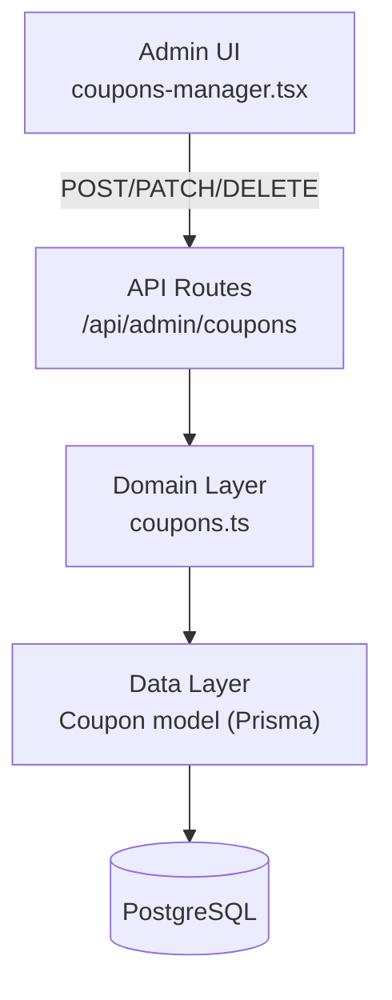

# ADR-007: Coupon Management System

| Field | Value |
|-------|-------|
| **Status** | Accepted |
| **Date** | 2026-08-14 |
| **Decision Maker** | Lucas |
| **Related** | ADR-003 (Transaction Management), ADR-006 (Game Type System) |

---

## Context

TCGHK currently has no coupon or discount management. The shop needs a way for admin to record and manage coupons — tracking how many exist, what they offer, and whether they're active.

This feature is intentionally scoped as a **standalone record system**. It is not integrated with checkout, orders, or any other service. The goal is to establish the data model and admin CRUD interface first, then integrate with checkout in a future iteration.

The existing codebase follows a consistent pattern for simple admin CRUD features (e.g., `GameType` at `/admin/games`). This ADR follows the same established patterns: Prisma model → domain layer (`src/lib/`) → API routes → admin page + client component.

---

## Architecture Pattern Assessment: 3-Layer Separation

The user proposed a 3-layer separation. Here's how it maps:

| Layer | Component | Responsibility |
|-------|-----------|----------------|
| **Data** | `Coupon` model in `prisma/schema.prisma` | Persists coupon records (name, code, description, quantity, isActive) |
| **Domain** | `src/lib/coupons.ts` | CRUD operations: create, list, update, delete. Validates quantity ≥ 0, code uniqueness. |
| **Presentation** | `src/app/admin/(panel)/coupons/page.tsx` + `src/components/admin/coupons-manager.tsx` + `src/app/api/admin/coupons/` | Admin dashboard UI + REST API endpoints |

**Assessment:** The mapping is correct. The domain layer is intentionally thin — there is no complex business logic because the coupon system is a standalone record with no integration points. When coupons eventually integrate with checkout, the domain layer will grow (validation against cart total, redemption logic, decrement-on-use). For now, thin CRUD is appropriate.



---

## Decision 1: Quantity = Total Redeemable Count

**Decision:** The `quantity` field represents how many times this coupon can be used in total across all customers. It is a simple integer that admin can change manually.

```prisma
quantity Int  // total redeemable count, admin-editable
```

### Alternatives Considered

| Option | Pros | Cons | Verdict |
|--------|------|------|---------|
| **A. Total redeemable count (chosen)** | Simple counter. Matches "inventory" mental model. Easy to understand. | Doesn't prevent one customer from using all. No per-user tracking. | ✅ |
| B. Per-customer limit | Fair distribution. Prevents abuse. | More complex — needs per-user usage tracking table. Over-engineered for a standalone record. | ❌ |
| C. Physical stock | Matches brick-and-mortar coupon book. | Hard to enforce online without codes per coupon. | ❌ |
| D. Unlimited (no quantity) | Simplest. | No scarcity control. | ❌ |

### Context
Admin needs to track how many coupons are "in circulation." Since the system is standalone (no checkout integration), quantity is a manually-edited number, not auto-decremented.

### Consequences
- **Positive:** Simple data model. Admin has full control to set and adjust quantity.
- **Negative:** No automatic decrement — admin must manually reduce quantity when coupons are used. Risk of stale data if admin forgets to update.
- **Review trigger:** When coupons integrate with checkout, replace manual editing with automatic decrement-on-redemption.

---

## Decision 2: Description = Single Free-Text Field

**Decision:** The coupon has a single `description: String` field. The admin form includes quick-fill buttons (e.g., "20% off", "HK$50 off", "Buy 1 Get 1") that populate the text field, but admin can also type any custom description.

```prisma
description String  // free text, quick-fill assisted
```

### Alternatives Considered

| Option | Pros | Cons | Verdict |
|--------|------|------|---------|
| **A. Single text field (chosen)** | Simplest schema. Matches "record system" framing. Quick-fill is purely UI — no parsing logic. | No structured data. Can't programmatically apply discounts later without parsing. | ✅ |
| B. Structured fields (`discountType` enum + `discountValue` Float + `note`) | Ready for checkout integration. Programmatic discount calculation. | Premature — designing for integration not yet decided. Constrains what admin can express. | ❌ (future candidate) |
| C. Both structured + free-text | Maximum flexibility. | Redundancy — description may contradict structured fields. | ❌ |

### Context
The coupon system is standalone. Description is informational only — it tells admin/staff what the coupon offers. When checkout integration is planned, Option B should be revisited.

### Consequences
- **Positive:** Zero parsing logic. Admin can write any description. Quick-fill buttons speed up common cases.
- **Negative:** Can't programmatically apply discounts. "20% off" and "九折" look different in text but mean similar things.
- **Review trigger:** When planning checkout integration, add `discountType` enum (PERCENT, FIXED_AMOUNT) and `discountValue` Float fields. (Option B — future candidate.)

---

## Decision 3: Auto-Generated Code from Name

**Decision:** Each coupon has a unique `code` field, auto-generated from the name (slugified), with admin able to override. Follows the same pattern as `GameType.slug`.

```prisma
code String @unique  // auto-generated from name, editable
```

```typescript
// Auto-generation logic (same as GameType slugify):
function generateCouponCode(name: string): string {
  return name.toLowerCase().trim()
    .replace(/[^\w\s-]/g, "")
    .replace(/[\s_]+/g, "-")
    .replace(/-+/g, "-")
    .replace(/^-+|-+$/g, "");
}
```

### Alternatives Considered

| Option | Pros | Cons | Verdict |
|--------|------|------|---------|
| A. Name only, no code | Simplest. One fewer field. | Name does double duty as identifier. Long names make poor codes. | ❌ |
| **B. Auto-generated code from name (chosen)** | Clean separation. Short unique identifier. Admin can override. Consistent with `GameType.slug` pattern. | One extra field. | ✅ |
| C. Manual code required | Full admin control. | Extra manual work. Risk of duplicates. | ❌ |

### Context
A short, unique code is needed so coupons can be referenced unambiguously. Auto-generation reduces admin friction while allowing override for custom codes.

### Consequences
- **Positive:** Unique, short identifiers. Consistent with existing `GameType.slug` pattern. Low admin friction.
- **Negative:** Admin may not understand why a code exists if they never use it externally.
- **Review trigger:** If coupons are never referenced by code (only by name), consider removing the field.

---

## Decision 4: Active Toggle + Delete

**Decision:** Coupons have an `isActive: Boolean` toggle (default true). Admin can deactivate a coupon without deleting it. Delete is still available for permanent removal.

```prisma
isActive Boolean @default(true)
```

### Alternatives Considered

| Option | Pros | Cons | Verdict |
|--------|------|------|---------|
| A. Delete only | Simplest. Fewer fields. | Destructive — can't recover deleted coupons. No way to pause temporarily. | ❌ |
| **B. Active toggle + delete (chosen)** | Non-destructive deactivation. Admin can pause coupons. Consistent with `GameType.isActive`. | One extra field + toggle button. | ✅ |
| C. Status enum (DRAFT / ACTIVE / EXPIRED / ARCHIVED) | Rich lifecycle tracking. | Over-engineered for standalone record system. | ❌ |

### Context
Admin may want to temporarily pause a coupon (e.g., "stop this promotion for now, might reactivate next month") without losing the record. The codebase already uses this pattern on `GameType`.

### Consequences
- **Positive:** Non-destructive. Data preservation. Consistent with codebase conventions.
- **Negative:** Inactive coupons still exist in the DB (need filtering in UI).
- **Review trigger:** If coupon lifecycle becomes complex (draft → review → active → expired), upgrade to status enum.

---

## Decision 5: No Expiry Date

**Decision:** Coupons do not have an expiry date field. Admin uses the `isActive` toggle to manually deactivate coupons when they are no longer valid.

### Alternatives Considered

| Option | Pros | Cons | Verdict |
|--------|------|------|---------|
| **A. No expiry (chosen)** | Simplest. No time-based logic. Matches "record system" framing. | Admin must manually deactivate expired coupons. | ✅ |
| B. Optional expiry date (`expiresAt: DateTime?`) | Automatic expiry. Flexible. | Introduces time-based logic (checking, auto-deactivating). Premature for standalone record. | ❌ |

### Context
The coupon system is standalone with no automated behavior. Adding expiry introduces complexity that belongs in an integrated system.

### Consequences
- **Positive:** No time-based logic. Simpler queries. Fewer fields.
- **Negative:** Admin must track expiry manually. Risk of stale active coupons.
- **Review trigger:** When coupons integrate with checkout, add `expiresAt: DateTime?` for automatic expiry validation.

---

## Consequence Summary

### Schema Changes Required

| Change | Type | Risk |
|--------|------|------|
| `Coupon` table | CREATE TABLE | Low — new table, no existing data affected |

### Coupon Model

```prisma
model Coupon {
  id          String   @id @default(uuid())
  name        String
  code        String   @unique
  description String
  quantity    Int
  isActive    Boolean  @default(true)
  createdAt   DateTime @default(now())
  updatedAt   DateTime @updatedAt
}
```

### New API Endpoints

| Endpoint | Method | Purpose |
|----------|--------|---------|
| `/api/admin/coupons` | GET | List all coupons |
| `/api/admin/coupons` | POST | Create coupon |
| `/api/admin/coupons/[id]` | PATCH | Update coupon (name, code, description, quantity, isActive) |
| `/api/admin/coupons/[id]` | DELETE | Delete coupon permanently |

### New UI Pages/Components

| Component | Location | Purpose |
|-----------|----------|---------|
| Coupons admin page | `src/app/admin/(panel)/coupons/page.tsx` | Admin coupon management |
| Coupons manager | `src/components/admin/coupons-manager.tsx` | Client component: list, create form, edit, delete, toggle active |
| Sidebar item | `src/components/admin/admin-sidebar.tsx` | Add "優惠券" nav item |
| Domain layer | `src/lib/coupons.ts` | CRUD functions |

### Admin Sidebar Addition

Add to `LINKS` array in `src/components/admin/admin-sidebar.tsx`:
```typescript
{ href: "/admin/coupons", label: "優惠券", icon: Ticket },
```

### Quick-Fill Description Buttons

The create/edit form includes quick-fill buttons that populate the `description` text field:
- "XX% off" → fills "20% off" (admin edits the number)
- "HK$XX off" → fills "HK$50 off"
- "Buy X Get Y" → fills "Buy 1 Get 1 Free"

These are purely UI shortcuts — the underlying field is still free text.

---

## Review Triggers

| Condition | Decision to Revisit |
|-----------|---------------------|
| Coupons integrate with checkout | Decision 2 (add structured discount fields), Decision 1 (auto-decrement), Decision 5 (add expiry) |
| Coupons need per-customer usage limits | Decision 1 (per-customer tracking) |
| Coupon lifecycle becomes complex | Decision 4 (upgrade to status enum) |
| Coupons are never referenced by code | Decision 3 (consider removing code field) |

---

## Architecture Assessment

| Layer | Correct? | Notes |
|-------|----------|-------|
| **Data** | ✅ | Clean Prisma model. No premature relationships. Fields map directly to user requirements. |
| **Domain** | ✅ | Thin CRUD layer — appropriate for standalone record system. Will grow when checkout integration is added. |
| **Presentation** | ✅ | Admin dashboard with standard CRUD UI. Follows established patterns (GameType, GamesManager). |

**Key architectural insight:** The coupon system is deliberately decoupled from checkout, orders, and transactions. This is a conscious "start simple, integrate later" decision. The data model is designed to be extensible — adding `discountType`, `discountValue`, `expiresAt`, and a `CouponRedemption` table later requires only additive migrations, no breaking changes.
