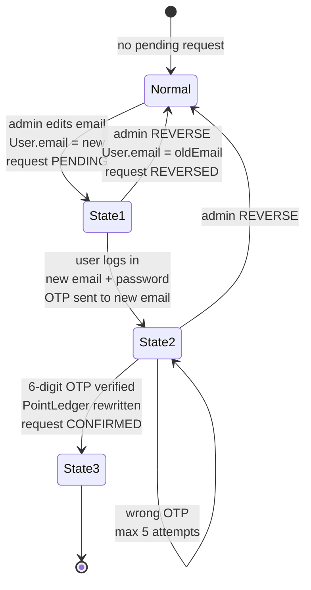

# ADR-008: Admin Account Management System

| Field | Value |
|-------|-------|
| **Status** | Accepted |
| **Date** | 2026-08-17 |
| **Decision Maker** | Lucas |
| **Related** | ADR-002 (email OTP flows), ADR-003 (transaction record), ADR-004 (email-keyed points) |

---

## Context

The admin panel (`src/app/admin/(panel)/`) has ten sections — content, coupons, data, games, orders, points, products, taxonomy, tournaments, transactions — but **none manage user accounts**. Admins cannot view, search, correct, or remove customer accounts. Account errors (wrong phone, misspelled email) are currently unfixable, and email is the identity key for the entire points system.

Relevant current state (verified in code):

- `User` model (`prisma/schema.prisma`): `id, email (unique), name?, phone?, passwordHash?, role, createdAt, updatedAt`, relations `orders[]` and `registrations[]` (both `userId String?`, Prisma default `SetNull` on delete)
- Passwords: `bcryptjs` 12 rounds (`src/lib/auth-password.ts`) — one-way, never viewable
- Existing verification-table pattern: `EmailVerification` (signup) and `PasswordReset` (forgot password), both per-purpose tables with bcrypt-hashed 6-digit OTP, 10-minute expiry, 5 attempts (`src/lib/otp.ts`)
- Points are **email-keyed** (`PointLedger`, ADR-004): balance = `SUM(delta) WHERE email = ?` — any email change must rewrite ledger rows
- `Order.email`, `Transaction.email`, `TournamentRegistration.email` are denormalized historical copies
- CSV tooling exists (`src/lib/csv-export.ts`, `csv-stringify`)
- `Tournament` already uses a soft-delete column (`deletedAt`)

This ADR covers: the accounts dashboard, editing (name/phone/email), the email-change verification state machine, admin-triggered password reset, account deletion, and CSV export.

---

## Architecture Pattern Assessment

The 3-layer separation as applied:

| Layer | Component | Responsibility |
|-------|-----------|----------------|
| Presentation | `src/app/admin/(panel)/accounts/page.tsx`, `src/components/admin/accounts-manager.tsx` | Dashboard, search, sort, CSV, edit window, reverse/delete/send-reset buttons |
| Presentation (user-side) | Login interstitial page/component | OTP wall shown when a pending email change exists at login |
| Domain | `src/lib/accounts.ts` (new) | Email-change state machine, soft delete/undelete, search + sort queries, CSV assembly |
| Domain (reused) | `src/lib/otp.ts`, `src/lib/email.ts`, `src/lib/points.ts`, `src/lib/auth-password.ts` | OTP generation/verification, email sending, `PointLedger` rewrite |
| Data | `EmailChangeRequest` table (new), `User.deletedAt` column (new) | Transition state + audit trail; soft-delete marker |

The user's proposed layering was correct. One refinement: the OTP interstitial is user-facing presentation (login flow), not admin presentation — it lives in the auth pages, not the admin panel.

---

## Decision 1: No password viewing

**Decision:** The dashboard has no "view password" capability. Passwords are bcrypt hashes and are never recoverable. For users who lost both email access and password (total loss of account control), the admin follows a manual procedure: user creates a new account in person; admin transfers points from the old email to the new one using the existing `ADMIN_ADJUST` ledger mechanism (`adminSetPoints(oldEmail, 0, note)` + `adminSetPoints(newEmail, balance, note)` in `src/lib/points.ts`). No new code.

### Alternatives Considered

| Option | Pros | Cons | Verdict |
|--------|------|------|---------|
| **No viewing + manual transfer procedure (chosen)** | Zero code; no security regression; reuses ADR-004 machinery | Manual admin work in a rare scenario | ✅ |
| Admin sets temporary one-time password | Helps walk-in users without inbox access | Shared-secret handoff; overlaps with admin-triggered reset; new code path | ❌ (future candidate) |
| Store passwords reversibly | Literal "view password" | Catastrophic security regression; breaks every existing flow | ❌ |

### Context
Admin cannot know a user's password — bcrypt is one-way by design. Points are the only user-held asset that matters across accounts.

### Consequences
- **Positive:** No security regression; the fallback needs no engineering.
- **Negative:** Total-loss users require in-person handling and two manual ledger entries.
- **Review trigger:** Walk-in customers regularly unable to receive emails → consider the temp-password flow.

---

## Decision 2: `EmailChangeRequest` table; `User.email` flips at edit time

**Decision:** A new per-purpose table stores the transition. When the admin initiates a change, `User.email` is **immediately** updated to the new email (state 1); the old email is preserved in the request row.

```prisma
model EmailChangeRequest {
  id          String   @id @default(uuid())
  userId      String   @unique   // one pending change per user
  oldEmail    String
  newEmail    String
  otpHash     String?            // set at login (state 2)
  attempts    Int      @default(0)
  expiresAt   DateTime?          // OTP expiry once generated
  status      String   @default("PENDING")  // PENDING → CONFIRMED | REVERSED
  createdAt   DateTime @default(now())
  confirmedAt DateTime?

  @@index([userId])
}
```

Flipping `User.email` immediately gives the required behavior for free: old-email login fails (email no longer on the row), new-email + correct-password login succeeds, and the `User.email` unique constraint rejects a new email that is already registered **at edit time**. Completed and reversed rows are kept permanently as an audit trail.

### Alternatives Considered

| Option | Pros | Cons | Verdict |
|--------|------|------|---------|
| **Separate `EmailChangeRequest` table (chosen)** | Matches existing `EmailVerification`/`PasswordReset` pattern; preserves `oldEmail` verbatim for reverse; audit trail; keeps `User` clean; `userId @unique` enforces one pending change | One more table + migration | ✅ |
| Columns on `User` (`pendingOldEmail`, …) | No join; no new table | Clutters identity table with mostly-null transition state; no audit after completion | ❌ |
| Reuse `PasswordReset` with a type flag | No new table | Wrong semantics; conflates self-service reset with admin-initiated identity change | ❌ |

### Context
Lucas flagged storage as the key open question. The codebase convention (per-purpose verification tables) and the audit value of email identity changes decided it.

### Consequences
- **Positive:** Reverse = one transaction (`User.email = oldEmail`, `status = REVERSED`); unique constraint validates new email early.
- **Negative:** Any code reading "the user's email" during a transition must be aware a pending request may exist (receipts, points display).
- **Review trigger:** If user-initiated (self-service) email change is added later, generalize this table rather than adding a parallel one.

---

## Decision 3: Password reset blocked while a change is pending

**Decision:** The admin "send password reset" button (and the self-service `forgot-password` route) returns an error if the account has a `PENDING` email change. Recovery for forgot-password-during-transition = admin reverses the change first, then resets via the old email. Total-loss cases fall to the Decision 1 manual procedure.

### Alternatives Considered

| Option | Pros | Cons | Verdict |
|--------|------|------|---------|
| **Block reset while pending (chosen)** | No takeover vector; zero new code paths; reverse button is the recovery tool | Admin round-trip in a rare case | ✅ |
| Allow reset, deliver to new email | No round-trip | Takeover vector: a typo'd or impostor-provided new email receives a reset link and seizes the account without knowing the password | ❌ |
| Hybrid: deliver to old email during pending | Covers forgot-password + old inbox intact | Extra branch; old inbox is often what was lost; rare scenario | ❌ (future candidate) |

### Context
The original flow assumed admin could tell the user their password — impossible (Decision 1). The pending state must not create a bypass.

### Consequences
- **Positive:** The 3-state machine is airtight; state 2 requires password knowledge.
- **Negative:** Extra admin steps in the rare forgot-password-during-pending case.
- **Review trigger:** That case recurs in practice → consider the old-email hybrid.

---

## Decision 4: Hard OTP interstitial at login

**Decision:** Logging in with a pending change (new email + correct password) lands on a blocking OTP screen — generated and sent at login (state 2), same UX as signup/reset verification. Nothing in the app is accessible until the 6-digit code is verified (state 3). No OTP is sent at admin-edit time.

### Alternatives Considered

| Option | Pros | Cons | Verdict |
|--------|------|------|---------|
| **Hard interstitial (chosen)** | Matches signup/reset patterns; guarantees state 3 (and the points rewrite) executes; simplest invariant: no verified email → no session | User without new-inbox access at that moment is fully locked out (escape = admin reverse) | ✅ |
| Usable session + persistent verify banner | Gentler | Machine becomes advisory; changes linger; points rewrite deferred indefinitely; more gating logic | ❌ |

### Context
The design language ("just as signup/reset verification") points at blocking flows; those are blocking in this codebase.

### Consequences
- **Positive:** Pending changes cannot linger; the transition completes or gets reversed.
- **Negative:** Complete unusability between edit and verification (accepted by design).
- **Review trigger:** Phone-initiated changes where users verify much later → consider admin-triggered OTP at edit time.

---

## Decision 5: Points transfer at state 3 = `PointLedger` rewrite only

**Decision:** On OTP verification: `UPDATE "PointLedger" SET email = newEmail WHERE email = oldEmail` (inside the confirming transaction), then the request row is marked `CONFIRMED`. If the new email already holds guest-purchase points, balances **merge** — identical semantics to ADR-004's guest→account unification. Historical records (`Order.email`, `Transaction.email`, `TournamentRegistration.email`) are **never rewritten**; they document what was true at transaction time.

### Alternatives Considered

| Option | Pros | Cons | Verdict |
|--------|------|------|---------|
| **Rewrite `PointLedger` only (chosen)** | Points (the live balance) follow the user; history stays honest; one statement | Old transactions searchable only by old email in email-based search | ✅ |
| Rewrite all email columns everywhere | Everything consistent under new email | Falsifies historical records; heavy migration-style update on financial data | ❌ |
| Copy rows instead of update | Preserves old rows | Duplicates ledger entries → double-counted balances unless zeroing; messy | ❌ |

### Context
ADR-004 keys points to email; the balance is derived, so a rewrite moves it cleanly.

### Consequences
- **Positive:** One-line transfer; merge behavior falls out of the SUM-by-email design for free.
- **Negative:** Email-based transaction search won't find pre-change records under the new email (admin dashboard links by user, unaffected).
- **Review trigger:** Admins routinely need old records under the new email → add an "also search historical emails" lookup via `EmailChangeRequest` audit rows.

---

## Decision 6: No auto-expiry on pending changes

**Decision:** A `PENDING` request never expires on its own. The reverse button is the sole recovery/abort tool. No background jobs introduced.

### Alternatives Considered

| Option | Pros | Cons | Verdict |
|--------|------|------|---------|
| **No auto-expiry (chosen)** | No cron/infra (none exists); pending state is safe (reset blocked, interstitial enforced) | Stale rows linger until admin reverses | ✅ |
| Auto-revert after N days | Self-cleaning | Requires scheduled jobs; auto-reverting an in-progress verification surprises users | ❌ |

### Context
The project has no background-job infrastructure; the pending state is already safe by Decisions 3–4.

### Consequences
- **Positive:** Zero infrastructure; behavior fully admin-controlled.
- **Negative:** Dashboard should surface pending changes (badge) so they aren't forgotten.
- **Review trigger:** Pending rows accumulate in practice → build the auto-revert job.

---

## Decision 7: Soft delete

**Decision:** Deleting an account sets `deletedAt` on `User` (mirroring `Tournament`). Deleted accounts: cannot log in, hidden from the dashboard by default, revealed by a filter with an un-delete action. Orders/registrations relations are untouched; the email remains occupied.

### Alternatives Considered

| Option | Pros | Cons | Verdict |
|--------|------|------|---------|
| **Soft delete (chosen)** | Reversible; audit intact; occupied email prevents anyone re-registering it and **inheriting the points balance** (email-keyed ledger) | All user queries must filter `deletedAt`; a returning user needs un-delete or a new email | ✅ |
| Hard delete (`SetNull` unlinks history) | Clean; email freed; re-registration inherits points | Irreversible; user linkage on orders lost | ❌ |
| Hard delete + cascade | — | Destroys financial records | ❌ |

### Context
Points attach to emails, so a freed email is an asset-inheritance hole; reversibility matters more than storage tidiness for a small shop.

### Consequences
- **Positive:** Undo exists; no FK fallout; email squatting on points impossible.
- **Negative:** Login, dashboard, and count queries filter `deletedAt`; email permanently occupied (by design).
- **Review trigger:** Test/spam-account cleanup dominates usage → add a "hard purge never-purchased accounts" admin tool as a separate decision.

---

## Decision 8: Dashboard, search, and CSV presentation defaults

**Decision:** Single search box matching id, name, email, or phone (case-insensitive contains); sort by join date asc/desc; CSV export via checkbox multi-select exporting **selected** rows with columns id, name, email, phone, createdAt (reusing `csv-stringify`); "send password reset" reuses the existing `forgot-password` server flow admin-side; "view transaction record" navigates to the transactions dashboard with the account prefilled — requiring new query-param prefill support in `transactions-manager` (small additive capability).

### Alternatives Considered

| Option | Pros | Cons | Verdict |
|--------|------|------|---------|
| **Stated defaults (chosen)** | Matches existing dashboard patterns; minimal UI surface | Export-all requires selecting all first (checkbox behavior covers it) | ✅ |
| Per-field advanced search | More precise | More UI than a small shop needs | ❌ |

### Context
Consistency with the transactions/points dashboards; the CSV utility already exists.

### Consequences
- **Positive:** One search control; CSV columns mirror the visible table.
- **Negative:** Transactions prefill is a cross-feature dependency (must be built alongside).
- **Review trigger:** Search feels insufficient at scale → add indexed per-field search.

---

## Email-Change State Machine



---

## Consequence Summary

### Schema Changes Required

| Change | Type | Risk |
|--------|------|------|
| `EmailChangeRequest` table | CREATE TABLE + enum-less status string | Low |
| `User.deletedAt` | ALTER TABLE ADD COLUMN (nullable) | Low |
| Rollback scripts required before feature logic (per implementation-plan skill) | — | — |

### New API Endpoints

| Endpoint | Purpose |
|----------|---------|
| `GET /api/admin/accounts` | List/search/sort/paginate; `?q=`, `?sort=`, `?includeDeleted=` |
| `PATCH /api/admin/accounts/[id]` | Edit name/phone |
| `POST /api/admin/accounts/[id]/email-change` | Initiate (state 1) |
| `POST /api/admin/accounts/[id]/email-change/reverse` | Reverse to old email |
| `POST /api/admin/accounts/[id]/send-reset` | Admin-triggered password reset (blocked while pending) |
| `DELETE /api/admin/accounts/[id]` | Soft delete |
| `POST /api/admin/accounts/[id]/undelete` | Un-delete |
| `GET /api/admin/accounts/export` | CSV of selected ids |
| `POST /api/auth/email-change/verify` | User-side OTP verify (state 3) |

### New UI Pages

| Page/Component | Purpose |
|----------------|---------|
| `src/app/admin/(panel)/accounts/page.tsx` | Dashboard shell |
| `src/components/admin/accounts-manager.tsx` | Table, search, sort, CSV, actions, edit window |
| Login interstitial (user-side) | Blocking OTP screen during pending change |
| `admin-sidebar` | "帳戶管理" entry |

---

## Review Triggers

| Condition | Revisit |
|-----------|---------|
| Walk-in users regularly can't receive email | Decision 1 (temp password flow) |
| Self-service email change requested | Decision 2 (generalize the table) |
| Forgot-password-during-pending recurs | Decision 3 (old-email hybrid) |
| Phone-initiated changes with late verification | Decision 4 (admin-triggered OTP) |
| Admins need old records under new email | Decision 5 (historical email lookup) |
| Pending rows accumulate | Decision 6 (auto-revert job) |
| Test-account cleanup dominates deletes | Decision 7 (hard purge tool) |

---

## Decision Summary

| # | Decision |
|---|----------|
| 1 | No password viewing; manual point-transfer procedure for total-loss users |
| 2 | `EmailChangeRequest` table; `User.email` flips at edit; rows kept for audit |
| 3 | Password reset blocked while pending |
| 4 | Hard OTP interstitial at login; OTP sent at login |
| 5 | State 3 rewrites `PointLedger` only; guest points merge; history untouched |
| 6 | No auto-expiry; reverse button is the abort tool |
| 7 | Soft delete via `User.deletedAt`; un-delete available; email stays occupied |
| 8 | Dashboard defaults: single search, date sort, selected-row CSV, reused reset flow, transactions prefill link |
