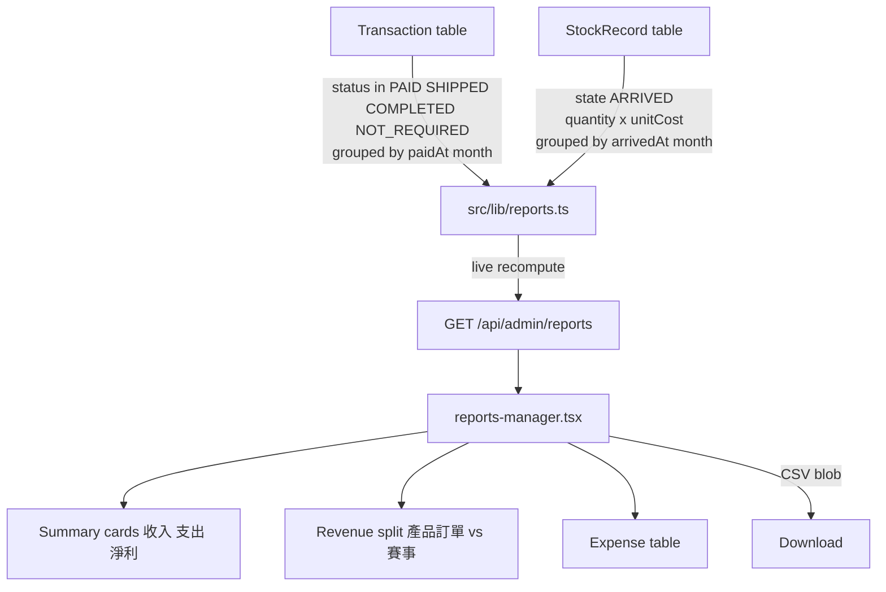

# ADR-009: Monthly Revenue Report

| Field | Value |
|-------|-------|
| **Status** | Accepted |
| **Date** | 2026-08-17 |
| **Decision Maker** | Lucas |
| **Related** | ADR-003 (Transaction Management), ADR-005 (Inventory Stocking) |

---

## Context

The shop currently has two disconnected money-related dashboards: the transaction dashboard (`/admin/transactions`, ADR-003) shows money *coming in*, and the stock record dashboard (ADR-005) shows stock *booked and arriving* with unit costs. Neither answers the owner's actual question: **"did we make or lose money this month?"**

The data needed for that answer already exists:

- **Income**: `Transaction` model (`prisma/schema.prisma`) — `amount Float`, `status OrderStatus` (PENDING / PAID / SHIPPED / COMPLETED / CANCELLED / FAILED / NOT_REQUIRED), `type TransactionType` (ORDER vs TOURNAMENT).
- **Expense**: `StockRecord` model — `quantity Int`, `unitCost Float`, `state StockState` (BOOKED / ARRIVED), `bookedAt`, `arrivedAt`.

One gap: `Transaction` has no payment timestamp. `createdAt` is order placement; `updatedAt` changes on any edit (remark, receipt resend). Neither reliably records *when money arrived*.

This ADR defines a monthly revenue report computed live from these two sources.

---

## Decision 1: Revenue Recognition — Money-Received Statuses

**Decision:** Earned revenue = sum of `Transaction.amount` where current `status ∈ {PAID, SHIPPED, COMPLETED, NOT_REQUIRED}`.

```typescript
const EARNED_STATUSES = ["PAID", "SHIPPED", "COMPLETED", "NOT_REQUIRED"] as const;
```

`NOT_REQUIRED` is confirmed to **always mean real money** — it is the admin's walk-in / cash / bank-transfer bucket (goods sold, money taken, no online payment). It is never used for complimentary $0 items.

Refunds require no special logic: admin flips status to `CANCELLED` (per ADR-003 any→any transitions are allowed), and the transaction drops out of the earned sum automatically.

### Alternatives Considered

| Option | Pros | Cons | Verdict |
|--------|------|------|---------|
| **A. Money-received statuses (chosen)** | Matches reality — every status where money changed hands, online or cash; refunds deduct for free | Trusts admin to use `NOT_REQUIRED` only for real sales | ✅ |
| B. Stripe-only (PAID/SHIPPED/COMPLETED) | Only verifiable online payments | Hides all walk-in cash revenue — report undercounts badly for a physical shop | ❌ |
| C. Accrual (all except CANCELLED/FAILED, incl. PENDING) | Counts orders at placement | PENDING may never pay → overstates revenue | ❌ |

### Context

The shop has physical walk-in customers; online-only revenue would be a fiction.

### Consequences
- **Positive:** Revenue figure equals actual money in, across Stripe and cash.
- **Negative:** If admin ever starts using `NOT_REQUIRED` for genuinely free items, revenue silently overcounts.
- **Review trigger:** Free/complimentary giveaways become a regular practice and need tracking.

---

## Decision 2: Expense Recognition — Arrived Stock Only

**Decision:** Spent = sum of `quantity × unitCost` where `StockRecord.state = 'ARRIVED'`, grouped by `arrivedAt` month. BOOKED records cost nothing until toggled arrived.

### Alternatives Considered

| Option | Pros | Cons | Verdict |
|--------|------|------|---------|
| **A. On arrival (chosen)** | No phantom expenses for bookings that never arrive; consistent with inventory transfer (booked→actual) | If suppliers demand upfront payment, real cash left earlier than reported | ✅ |
| B. On booking (`bookedAt`) | Reflects cash flow when paying upfront | A never-arriving booking permanently inflates expenses; StockRecord has no cancel mechanism to fix it | ❌ |
| C. Both views | Most informative | Doubles report complexity for marginal insight at current scale | ❌ |

### Context

Suppliers are paid on delivery, so arrival date is both the physical and financial truth.

### Consequences
- **Positive:** Expense = cost of goods the shop actually holds; self-heals if a booking is quietly forgotten.
- **Negative:** A month with heavy booking but no arrivals shows misleadingly low spend (inventory commitment is invisible in this report).
- **Review trigger:** Supplier payment terms change to prepaid, or committed-but-unarrived spend needs visibility.

---

## Decision 3: Payment Anchor — New `paidAt` Field, HK Month Boundaries

**Decision:** Add `paidAt DateTime?` to `Transaction`. It is set (or refreshed) every time status transitions **into** a money-received status from a non-money status. Month boundaries are computed in **Asia/Hong_Kong (UTC+8)**.

```prisma
model Transaction {
  // ...existing fields
  paidAt DateTime?   // set when status enters PAID/SHIPPED/COMPLETED/NOT_REQUIRED
}
```

Rule: "last time money arrived." If a transaction goes PAID → CANCELLED (refund) → PAID (re-marked), the fresh payment moment wins. First payment and re-payment follow the same rule.

Backfill migration: `paidAt = createdAt` for all existing rows already in a money-received status (true historical payment dates are unrecoverable; a one-time approximation beats staying wrong forever).

Status-write paths that must maintain `paidAt`:
- `src/app/api/webhooks/stripe/route.ts` (Stripe → PAID)
- `src/app/api/admin/orders/[id]/route.ts` (manual PAID transition)
- `src/app/api/admin/transactions/[id]/route.ts` (admin status edits)

### Alternatives Considered

| Option | Pros | Cons | Verdict |
|--------|------|------|---------|
| **B. New `paidAt` field (chosen)** | Most truthful — revenue lands in the month money actually arrived; symmetric with expense anchoring on `arrivedAt` | Schema change + migration + backfill + maintenance in 3 write paths | ✅ |
| A. `createdAt` | No schema change; deterministic | Jan-31 order paid Feb-2 counts as January revenue | ❌ |
| C. `updatedAt` | No schema change | Any later remark edit silently moves revenue between months — unstable report | ❌ |

### Context

Expenses anchor on physical arrival (`arrivedAt`); revenue deserves the same honesty. A one-day-per-month edge (HK midnight vs UTC midnight) would misfile late-night payments without explicit timezone handling.

### Consequences
- **Positive:** Revenue and expense months are both "when it actually happened," in local shop time.
- **Negative:** `paidAt` maintenance is now a cross-cutting concern — any *future* status-write path must remember it (review trigger for all future transaction mutations). Backfilled rows carry an approximation, not the true payment moment.
- **Review trigger:** A future status-write path is added without setting `paidAt` (revenue leaks out of the report); or formal accounting requires true historical payment dates.

---

## Decision 4: Live Recompute — No Snapshots

**Decision:** The report always queries current data on view. No stored monthly snapshot table.

### Alternatives Considered

| Option | Pros | Cons | Verdict |
|--------|------|------|---------|
| **A. Live recompute (chosen)** | Refunds/corrections always reflected; zero new storage; dead simple | Historical months shift — "what I reported in August" isn't reproducible later | ✅ |
| B. Frozen monthly snapshots | Stable history for bookkeeping/audit | New table + month-closing mechanism; a late refund makes stored numbers silently wrong; significant complexity | ❌ |

### Context

This is management insight for the owner, not formal accounting.

### Consequences
- **Positive:** The number shown always accounts for yesterday's refund.
- **Negative:** A figure screenshotted last month may not match the same month re-opened today.
- **Review trigger:** Supervisor/auditor needs reproducible frozen figures.

---

## Decision 5: Placement — New Sidebar Page

**Decision:** New admin page at `/admin/reports` ("收益報告"), with a month picker defaulting to the current month. Sidebar entry added to the `LINKS` array in `src/components/admin/admin-sidebar.tsx`.

### Alternatives Considered

| Option | Pros | Cons | Verdict |
|--------|------|------|---------|
| **A. New sidebar page (chosen)** | Follows the established pattern (遊戲管理 ADR-006, 優惠券 ADR-007, 帳戶管理 ADR-008); room for full layout | Sidebar grows by one item | ✅ |
| B. Tab in transactions dashboard | Next to source data | Misleading — expenses come from stock records, not transactions; page already tabbed | ❌ |
| C. Admin home widget | At-a-glance summary | No admin home page exists; month navigation still needs a full page | ❌ |

### Consequences
- **Positive:** Own URL, clean layout, consistent with every prior feature.
- **Negative:** Sidebar is long; if it becomes unusable, a nav regroup is a cheap follow-up that does not affect this feature's internals.
- **Review trigger:** Admin sidebar exceeds comfortable length.

---

## Decision 6: Content — Cards + Two Breakdowns

**Decision:** The report page shows, for the selected month:

1. **Three summary cards**: 收入, 支出, 淨利
2. **Revenue split**: 產品訂單 vs 賽事 — `sum(amount)` grouped by `type`
3. **Expense table**: each ARRIVED `StockRecord` in the month — product name, condition, foil, quantity, unit cost, line total, arrival date

### Alternatives Considered

| Option | Pros | Cons | Verdict |
|--------|------|------|---------|
| **A. Cards + two breakdowns (chosen)** | Answers "money came from where / went to what" without duplicating existing dashboards | Two sections to build | ✅ |
| B. Cards only | Fastest to build | "Spent $4,300… on what?" forces manual cross-checking | ❌ |
| C. A + chart + buyer-type split | Most insight | ~2 data points per month makes charts noise; extra build cost for unrequested answers | ❌ |

### Context

Transaction-level detail already lives in `/admin/transactions`; per-record stock detail lives in the stock dashboard. The report only needs the aggregation layer.

### Consequences
- **Positive:** Complete answer to the monthly question at modest build cost.
- **Negative:** No trend visibility across months (single-month view only).
- **Review trigger:** Enough months of data accumulate that a trend chart becomes meaningful.

---

## Decision 7: CSV Export

**Decision:** An export button downloads the selected month's report as CSV (summary rows + expense records), following the existing server-blob pattern used by the accounts dashboard (`accounts-manager.tsx` fetches a blob and triggers download).

### Alternatives Considered

| Option | Pros | Cons | Verdict |
|--------|------|------|---------|
| **A. Yes (chosen)** | Forwardable to supervisor; offline records; reuses existing pattern | One more endpoint to build and test | ✅ |
| B. No | Less work | Sharing numbers means screenshotting tables | ❌ |

### Consequences
- **Positive:** Report can leave the browser.
- **Negative:** CSV numbers are live-computed at download time — same non-reproducibility as Decision 4.
- **Review trigger:** None expected; superseded only if formal reporting replaces it.

---

## Consequence Summary

### Schema Changes Required

| Change | Type | Risk |
|--------|------|------|
| `Transaction.paidAt DateTime?` | ADD COLUMN (nullable, no default) | Low — additive |
| Backfill `paidAt = createdAt` for money-status rows | UPDATE | Low — approximation documented above |
| Rollback script | DROP COLUMN `paidAt` | Low |

### New API Endpoints

| Endpoint | Method | Purpose |
|----------|--------|---------|
| `/api/admin/reports?month=YYYY-MM` | GET | Summary cards + revenue split + expense records |
| `/api/admin/reports/export?month=YYYY-MM` | GET | CSV blob download |

### Modified Files (Existing)

| File | Change |
|------|--------|
| `src/app/api/webhooks/stripe/route.ts` | Set `paidAt` on Stripe PAID transition |
| `src/app/api/admin/orders/[id]/route.ts` | Set `paidAt` on manual PAID transition |
| `src/app/api/admin/transactions/[id]/route.ts` | Set `paidAt` on any admin status transition into money statuses |
| `src/components/admin/admin-sidebar.tsx` | Add "收益報告" nav item |
| `prisma/schema.prisma` | Add `paidAt` field |

### New UI Pages / Components

| Component | Location | Purpose |
|-----------|----------|---------|
| Reports admin page | `src/app/admin/(panel)/reports/page.tsx` | Page shell |
| Reports manager | `src/components/admin/reports-manager.tsx` | Month picker, cards, revenue split, expense table, CSV button |
| Domain layer | `src/lib/reports.ts` | Pure aggregation functions + HK month-boundary helpers |

---

## Review Triggers

| Condition | Revisit Decision |
|-----------|-----------------|
| `NOT_REQUIRED` used for $0/complimentary items | Decision 1 |
| Supplier terms become prepaid; committed spend needs visibility | Decision 2 |
| New status-write path forgets `paidAt` maintenance | Decision 3 |
| Formal accounting / reproducible figures required | Decisions 3, 4 |
| Sidebar too long to navigate | Decision 5 |
| Many months of data; trends wanted | Decision 6 |

---

## Data Flow



**Key insight:** the report owns no data of its own — it is a pure read-side aggregation over the ledgers introduced by ADR-003 and ADR-005. The only state it introduces (`paidAt`) exists to make the income ledger timestampable.
