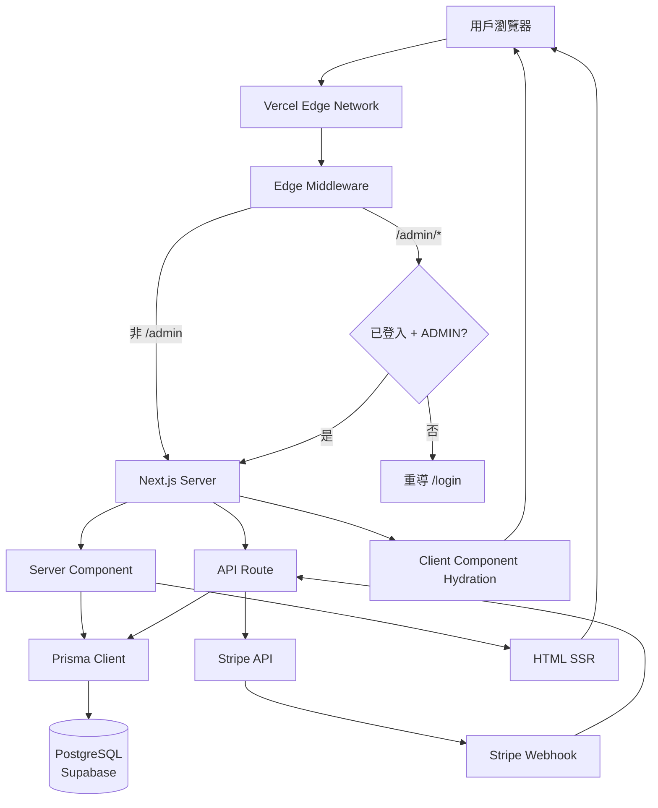
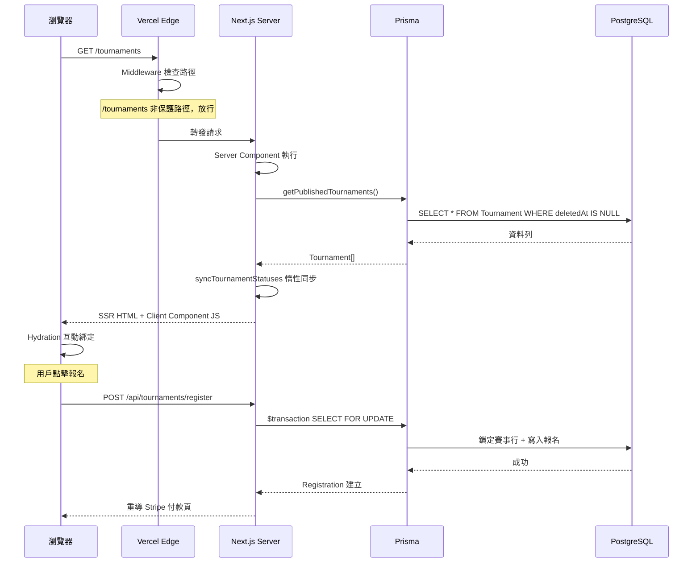
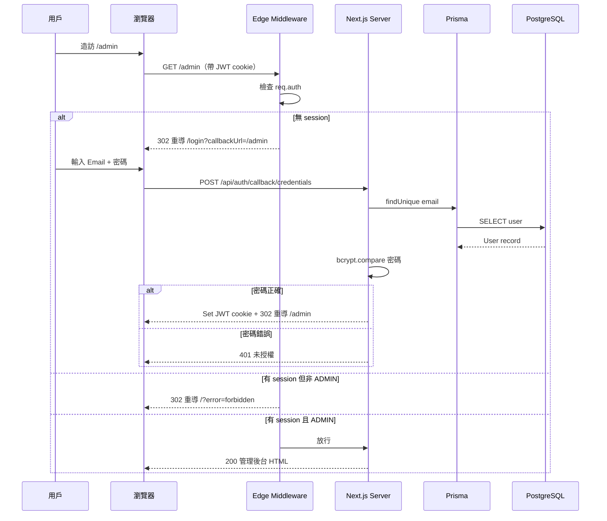
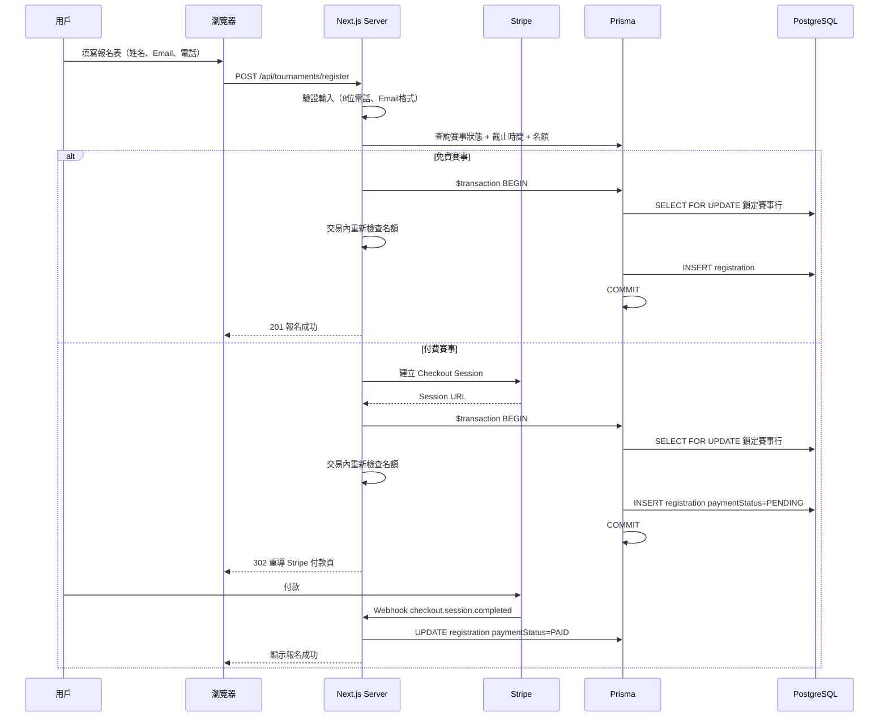
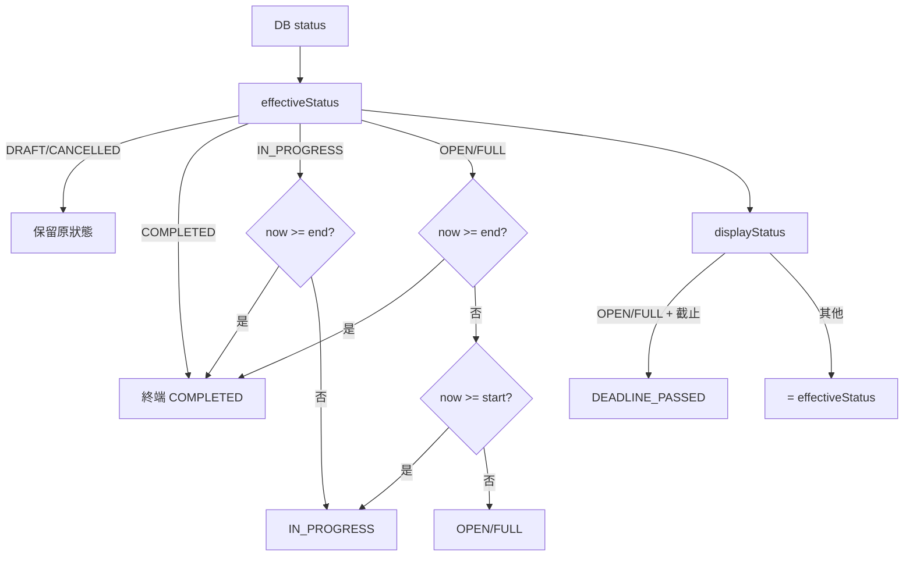
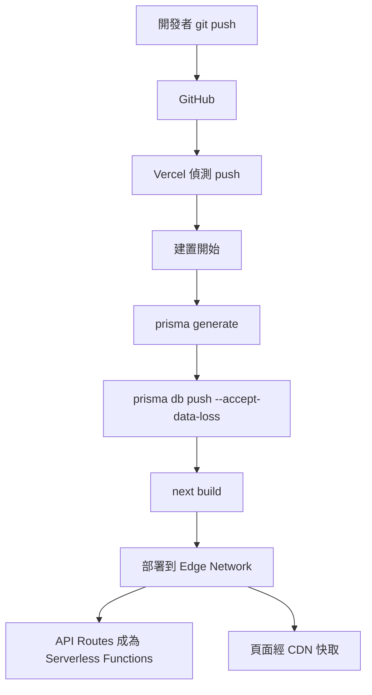

Next.js 16.2.6 (with Turbopack) — the core framework
- **React 19.2.4** — UI library
- **TypeScript** — language
- **Prisma 7.8.0** — ORM, connected to **PostgreSQL** (hosted on Supabase)
- **NextAuth v5** (beta) — authentication (credentials-based login)
- **Stripe** — payment processing
- **@base-ui/react** — UI component primitives (not Radix)
- **Tailwind CSS** — styling
- **Vercel** — deployment platform

## Review
### What is the framework
# TCGHK 系統架構文件

> **這份文件詳細說明 TCGHK 網站的技術架構**——由前端到後端、資料庫到部署，涵蓋所有框架的關係與運作流程，讓開發者能快速理解整個系統的運作方式。

| 項目 | 詳情 |
|------|------|
| **架構類型** | 全端 JavaScript / TypeScript（Next.js App Router） |
| **核心框架** | Next.js 16.2.6 + React 19.2.4 |
| **資料庫** | PostgreSQL（Supabase 託管） |
| **認證** | NextAuth v5（Credentials Provider + JWT） |
| **付款** | Stripe（商品結帳 + 賽事報名費） |
| **部署** | Vercel（Edge Network + Serverless Functions） |
| **語言** | TypeScript ^5 / 繁體中文（zh-HK） |

---

## 目錄

1. [技術棧總覽](#1-技術棧總覽)
2. [系統架構圖](#2-系統架構圖)
3. [框架關係與運作流程](#3-框架關係與運作流程)
4. [應用層結構](#4-應用層結構)
5. [資料層與 Prisma](#5-資料層與-prisma)
6. [認證與權限](#6-認證與權限)
7. [付款流程（Stripe）](#7-付款流程stripe)
8. [店賽系統](#8-店賽系統)
9. [前端 UI 層](#9-前端-ui-層)
10. [關鍵設計模式](#10-關鍵設計模式)
11. [環境變數](#11-環境變數)
12. [檔案結構](#12-檔案結構)
13. [部署流程](#13-部署流程)

---

## 1. 技術棧總覽

| 層級         | 技術                   | 版本             | 用途                                                          |
| ---------- | -------------------- | -------------- | ----------------------------------------------------------- |
| **框架**     | Next.js              | 16.2.6         | 全端 React 框架（App Router、Server/Client Components、API Routes） |
| **UI 程式庫** | React                | 19.2.4         | 前端渲染                                                        |
| **程式語言**   | TypeScript           | ^5             | 型別安全                                                        |
| **ORM**    | Prisma               | ^7.8.0         | 資料庫存取與 schema 管理                                            |
| **資料庫**    | PostgreSQL（Supabase） | —              | 關聯式資料庫                                                      |
| **認證**     | NextAuth v5          | ^5.0.0-beta.31 | Email/密碼認證、JWT Session                                      |
| **付款**     | Stripe               | ^22.1.1        | 線上付款（商品結帳 + 賽事報名費）                                          |
| **UI 元件**  | @base-ui/react       | ^1.5.0         | 無樣式 UI 原語（Select、Dialog 等）                                  |
| **樣式**     | Tailwind CSS         | ^4             | Utility-first CSS                                           |
| **日期工具**   | date-fns             | ^4.4.0         | 日期計算                                                        |
| **日曆**     | react-day-picker     | ^10.0.1        | 日期選擇器                                                       |
| **密碼雜湊**   | bcryptjs             | ^3.0.3         | 密碼加密                                                        |
| **部署**     | Vercel               | —              | 託管與 CI/CD                                                   |

💡 本專案使用 **@base-ui/react**（非 Radix UI），兩者 API 不同。若需查閱元件用法，請參考 `node_modules/@base-ui/react` 的原始碼。

---

## 2. 系統架構圖

### 整體架構



### 頁面載入請求生命週期



---

## 3. 框架關係與運作流程

### Vercel → Next.js

Vercel 是部署平台。每次 `git push` 到 `feature/` 分支後，Vercel 自動觸發建置，執行 build script：

```
prisma generate && prisma db push --accept-data-loss && next build
```

1. **`prisma generate`** — 從 `schema.prisma` 生成 Prisma Client TypeScript 程式碼
2. **`prisma db push --accept-data-loss`** — 將 schema 同步至生產資料庫（非 `migrate deploy`）
3. **`next build`** — 編譯 Next.js 應用，產生 SSR 頁面與 serverless API functions

建置完成後，Vercel 將應用部署到 Edge Network。頁面由全球 CDN 快取，API Routes 以 serverless functions 運行。

### Next.js → React

Next.js 16 使用 App Router，每個 `src/app/` 下的檔案自動對應一個路由：

- **Server Components**（預設）— 在伺服器端執行，直接透過 Prisma 查詢資料庫，將 HTML 發送到瀏覽器。不攜帶 JavaScript，效能最佳。
- **Client Components**（標記 `"use client"`）— 在瀏覽器端執行，負責互動邏輯（表單、狀態管理、事件處理）。

> ⚠️ **Next.js 16 重大變更**：
> - `useParams()` 回傳 `encodeURIComponent` 編碼的值，使用前必須 `decodeURIComponent()`（已修復中文 slug 404 問題）
> - `params` 是 Promise，必須 `await`
> - 如需確認 API 行為，查閱 `node_modules/next/dist/docs/` 內的文件

### Next.js → NextAuth

NextAuth v5 提供認證功能，採用 Credentials Provider（Email + 密碼）：

| 元件                | 檔案                       | 職責                               |
| ----------------- | ------------------------ | -------------------------------- |
| **Middleware**    | `src/middleware.ts`      | Edge 層攔截 `/admin/*`，檢查 JWT       |
| **Auth Config**   | `src/auth.config.ts`     | JWT 策略，Token 含 `id` + `role`     |
| **Auth Setup**    | `src/auth.ts`            | Credentials Provider，bcryptjs 驗證 |
| **Server Helper** | `src/lib/auth-server.ts` | `requireAdmin()` 供 API Route 使用  |
|                   |                          |                                  |

### Next.js → Prisma → PostgreSQL

Server Components 和 API Routes 透過 Prisma Client singleton 查詢 PostgreSQL：

```
Server Component / API Route
    ↓ getPrisma()
src/lib/prisma.ts（Singleton）
    ↓ @prisma/adapter-pg + pg.Pool
PostgreSQL（Supabase）
```

- **Singleton 模式**：使用 `globalThis` 快取 `PrismaClient`，避免 serverless 環境下每次請求建立新連線導致連線池耗盡
- **Schema 版本管理**：`PRISMA_SCHEMA_VERSION` 常數在 schema 變更後手動遞增，開發環境 HMR 會偵測版本變化並重建 Client
- **連線方式**：`@prisma/adapter-pg` + `pg.Pool`（非預設 Prisma 連線引擎）

### Next.js → Stripe

Stripe 處理兩條付款流程：

1. **商品結帳** — `POST /api/checkout` 建立 Checkout Session，用戶在 Stripe 頁面付款，webhook 確認後更新訂單狀態
2. **賽事報名費** — `POST /api/tournaments/register` 建立 Checkout Session，webhook 確認後更新 `paymentStatus`

兩條流程共用同一個 webhook 端點 `/api/webhooks/stripe`，根據 metadata 區分訂單類型。

### React → @base-ui/react → Tailwind CSS

UI 層的技術組合：

- **@base-ui/react** — 無樣式（unstyled）可存取性 UI 原語，提供 Select、Dialog、Tooltip 等。與 Radix UI API 不同，例如 `SelectContent` 使用 `collisionAvoidance` prop 而非 Radix 的 `sideOffset`
- **Tailwind CSS v4** — Utility-first CSS 框架，透過 `@tailwindcss/postcss` 整合
- **shadcn** — CLI 工具，用於 scaffold 元件變體（非 npm 套件依賴）
- **class-variance-authority + clsx + tailwind-merge** — 管理條件樣式與變體

主題系統支援深色 / 淺色模式，預設深色。`ThemeProvider` 使用 `useLayoutEffect` 避免閃爍，同步 localStorage + cookie（SSR 時從 cookie 讀取）。

---

## 4. 應用層結構

### App Router 路由

| 路徑 | 類型 | 說明 |
|------|------|------|
| `src/app/layout.tsx` | Server Component | 根佈局：ThemeProvider → AuthSessionProvider → CartProvider → SiteHeader + main + SiteFooter |
| `src/app/page.tsx` | Server Component | 首頁：首頁 Banner（DB）、精選商品（DB）、即將舉辦的店賽（Demo 資料） |
| `src/app/tournaments/page.tsx` | Server Component | 店賽日程頁（`force-dynamic`），透過 `getPublishedTournaments()` 取資料 |
| `src/app/tournaments/[slug]/register/page.tsx` | Client Component | 報名頁，用 `useParams()` + `decodeURIComponent()` 處理中文 slug |
| `src/app/admin/(panel)/layout.tsx` | Server Component | 管理後台佈局，TaxonomyProvider + AdminSidebar |
| `src/app/admin/(panel)/*/page.tsx` | Server/Client | 各管理頁面（商品、訂單、賽事、標籤、內容） |
| `src/app/admin/tournaments/bin/page.tsx` | Server Component | 回收站頁面 |
| `src/app/api/*/route.ts` | API Routes | REST API 端點 |

### Provider 巢狀結構

```
ThemeProvider（深色/淺色，cookie + localStorage）
  └─ AuthSessionProvider（NextAuth session）
       └─ CartProvider（購物車狀態，localStorage）
            └─ TaxonomyProvider（管理後台用，標籤資料）
```

### API Routes 一覽

| 端點 | 方法 | 認證 | 說明 |
|------|------|------|------|
| `/api/checkout` | POST | — | 商品結帳，建立 Stripe Checkout Session + 寫入 Order |
| `/api/checkout/session` | GET | — | 確認付款結果，回傳訂單詳情 |
| `/api/webhooks/stripe` | POST | Stripe簽章 | 處理 `checkout.session.completed`（商品 + 賽事） |
| `/api/tournaments/register` | POST | — | 賽事報名（含 Stripe 付款 + TOCTOU 防護） |
| `/api/tournaments/register/session` | GET | — | 確認賽事報名付款結果 |
| `/api/products` | GET | — | 商品列表（分頁 + 篩選） |
| `/api/taxonomy` | GET | — | 標籤資料（公開） |
| `/api/admin/tournaments` | GET, POST | ADMIN | 賽事列表 / 建立賽事 |
| `/api/admin/tournaments/[id]` | PATCH | ADMIN | 更新賽事狀態 / 截止時間 |
| `/api/admin/tournaments/batch` | POST | ADMIN | 批次建立賽事（自動編號） |
| `/api/admin/tournaments/trash` | GET | ADMIN | 回收站列表 |
| `/api/admin/tournaments/restore` | POST | ADMIN | 還原賽事 |
| `/api/admin/tournaments/bin` | DELETE | ADMIN | 永久刪除（單一/批次/全部） |
| `/api/admin/upload` | POST | ADMIN | 檔案上傳至 `public/uploads/` |
| `/api/admin/stats` | GET | ADMIN | 儀表板統計數據（並行查詢） |
| `/api/admin/taxonomy` | GET, POST | ADMIN | 標籤 CRUD |
| `/api/admin/products` | GET, POST | ADMIN | 商品列表 / 建立 |
| `/api/admin/products/[id]` | PATCH, DELETE | ADMIN | 商品更新 / 刪除 |
| `/api/admin/orders` | GET | ADMIN | 訂單列表 |

---

## 5. 資料層與 Prisma

### Prisma Client 設定

**Singleton 模式**（`src/lib/prisma.ts`）：

```typescript
const globalForPrisma = globalThis as unknown as {
  prisma: PrismaClient | undefined;
  prismaSchemaVersion: string | undefined;
};

const PRISMA_SCHEMA_VERSION = "20260708120000_tournament_soft_delete";

export function getPrisma(): PrismaClient {
  if (!isDatabaseConfigured()) throw new Error("DATABASE_URL is not set");
  const stale = globalForPrisma.prismaSchemaVersion !== PRISMA_SCHEMA_VERSION;
  if (!globalForPrisma.prisma || stale) {
    globalForPrisma.prisma = createPrismaClient();
    globalForPrisma.prismaSchemaVersion = PRISMA_SCHEMA_VERSION;
  }
  return globalForPrisma.prisma;
}
```

- 使用 `@prisma/adapter-pg` + `pg.Pool` 連接 PostgreSQL（非預設 Prisma 連線引擎）
- `PRISMA_SCHEMA_VERSION` 在 schema 變更後手動遞增，HMR 偵測版本不符時重建 Client

**資料庫同步**：使用 `prisma db push --accept-data-loss`（非 `prisma migrate deploy`），因為生產資料庫未有 migration baseline（會觸發 P3005 錯誤）。Build script 內建此指令。

### 資料模型

| 模型                       | 說明                | 關聯                                               |
| ------------------------ | ----------------- | ------------------------------------------------ |
| `User`                   | 使用者（USER / ADMIN） | → Order, → TournamentRegistration                |
| `Product`                | 商品（單卡 / 封盒）       | → ProductVariant, → Image, → HomeFeaturedProduct |
| `ProductVariant`         | 商品規格（品相、閃卡、價格、庫存） | → Product, → OrderItem                           |
| `Image`                  | 商品圖片              | → Product                                        |
| `Order`                  | 訂單                | → User, → OrderItem                              |
| `OrderItem`              | 訂單項目              | → Order, → ProductVariant                        |
| `Tournament`             | 店賽                | → TournamentRegistration                         |
| `TournamentRegistration` | 賽事報名紀錄            | → Tournament, → User                             |
| `TaxonomyOption`         | 標籤（系列、稀有度、卡號等）    | —                                                |
| `HomeBanner`             | 首頁輪播              | —                                                |
| `HomeFeaturedProduct`    | 首頁精選商品            | → Product                                        |
| `AboutPageContent`       | 關於我們頁面內容          | —                                                |

### 軟刪除模式（Tournament）

Tournament 模型使用 `deletedAt: DateTime?` 欄位實現軟刪除：

| `deletedAt` 值 | 狀態 | 可見性 |
|---------------|------|--------|
| `null` | 正常 | 公開列表 + 管理列表 |
| 非 `null` | 已移入回收站 | 僅回收站列表 |

- 所有公開查詢和管理列表都過濾 `deletedAt: null`
- 回收站查詢使用 `deletedAt: { not: null }`
- 軟刪除的賽事禁止任何狀態變更、截止時間修改和報名（效果等同 CANCELLED）
- 管理員可從回收站還原（設回 `deletedAt: null`）或永久刪除

### 唯一約束（防重複報名）

```prisma
@@unique([tournamentId, email])   // 同一賽事不可用相同 Email 重複報名
@@unique([tournamentId, phone])   // 同一賽事不可用相同電話重複報名
```

這些 DB 級約束是 TOCTOU 防護的最終防線（見 [§7 付款流程](#7-付款流程stripe)）。

---

## 6. 認證與權限

### 認證架構

| 層級 | 元件 | 運行環境 | 職責 |
|------|------|---------|------|
| **路由層** | `src/middleware.ts` | Edge | 攔截 `/admin/*`，檢查 JWT |
| **API 層** | `src/lib/auth-server.ts` | Serverless | `requireAdmin()` 檢查 role |
| **驗證層** | `src/auth.ts` | Serverless | Credentials Provider + bcryptjs |
| **Session** | `src/auth.config.ts` | Edge + Serverless | JWT 策略，Token 含 `id` + `role` |

### 認證流程



### 雙層防護

1. **Edge Middleware**（`src/middleware.ts`）— 在 Edge 運行，攔截所有 `/admin/:path*`：
   - 未登入 → 重導 `/login?callbackUrl=原路徑`
   - 已登入但非 ADMIN → 重導 `/?error=forbidden`
   
2. **API 層**（`src/lib/auth-server.ts`）— 每個 admin API route 呼叫 `requireAdmin()`：
   - 檢查 `session.user.role === "ADMIN"`
   - 否則回傳 `403 Forbidden`

💡 即使有人繞過前端直接呼叫 API，`requireAdmin()` 仍會阻擋未授權請求。

---

## 7. 付款流程（Stripe）

### 商品結帳流程

1. 用戶在購物車頁面點擊「結帳」
2. Client Component `POST /api/checkout`，傳送購物車內容
3. Server 計算運費 → 建立訂單（`Order`, `status=PENDING`）→ 建立 Stripe Checkout Session
4. 回傳 Stripe Session URL，用戶重導到 Stripe 付款頁
5. 付款完成 → Stripe 發送 webhook 到 `/api/webhooks/stripe`
6. Webhook 處理 `checkout.session.completed`：更新 `Order.status=PAID`，扣減庫存

### 賽事報名付款流程



### TOCTOU 防護（Time-of-Check to Time-of-Use）

賽事報名使用三重防護防止併發超賣：

| 層級 | 機制 | 說明 |
|------|------|------|
| **第一層** | 應用層檢查 | `findUnique` / `findMany` 快速路徑，拒絕明顯的重複 |
| **第二層** | `SELECT FOR UPDATE` 行鎖 | `$transaction` 內鎖定賽事行，序列化並發請求 |
| **第三層** | DB unique constraints | `@@unique([tournamentId, email])` + `@@unique([tournamentId, phone])` 最終防線 |

💡 已通過壓力測試驗證：並發 2 請求同一最後名額 → 一個 201 成功，一個 400 名額已滿，無超賣。

### 送貨費計算

`src/lib/checkout.ts` 的運費邏輯：

| 條件 | 運費 |
|------|------|
| 訂單 ≥ HK$500 | 免運 |
| 訂單 < HK$500 | HK$30 |
| 門市自取 | 免運 |

---

## 8. 店賽系統

### 賽事狀態機

| DB 狀態 | 顯示標籤 | 說明 |
|---------|---------|------|
| `DRAFT` | 草稿 | 手動狀態，永不自動變更，不公開顯示 |
| `OPEN` | 報名中 | 自動隨時間推進至 IN_PROGRESS |
| `FULL` | 已滿 | 可被取消，不可回到 OPEN |
| `IN_PROGRESS` | 進行中 | 到結束時間自動 → COMPLETED |
| `COMPLETED` | 已結束 | 終端狀態，不可變更 |
| `CANCELLED` | 已取消 | 手動狀態，可恢復為 OPEN |

**計算狀態**（不存入 DB）：

| 計算狀態 | 顯示標籤 | 觸發條件 |
|---------|---------|---------|
| `DEADLINE_PASSED` | 已截止 | 當 `effectiveStatus` 為 OPEN/FULL 且 `registrationDeadline < now` |

### 三層狀態邏輯



1. **`effectiveStatus()`** — 基於時間計算：DRAFT/CANCELLED 永不變更；OPEN→IN_PROGRESS→COMPLETED 自動推進
2. **`displayStatus()`** — 在 `effectiveStatus` 上疊加截止時間判斷：OPEN/FULL + 截止已過 → DEADLINE_PASSED
3. **`syncTournamentStatuses()`** — 惰性同步：在讀取時（公開列表 + 管理列表）執行，將過時的 DB 狀態更新為 `effectiveStatus`，無需 cron job

### 狀態顯示優先級

當一個日期格內有多場賽事時，日曆和列表按以下優先級排序和顯示：

```
已取消 > 已結束 > 進行中 > 已截止 > 已滿 > 報名中
```

例如：一場「已取消但原本報名中」的賽事，會顯示為「已取消」。

### 賽事操作

| 操作 | 端點 | 說明 |
|------|------|------|
| **單一建立** | `POST /api/admin/tournaments` | 建立單場賽事（含標題、格式、人數、費用、獎品、描述） |
| **批次建立** | `POST /api/admin/tournaments/batch` | 多日期批次建立，自動編號（#1, #2, #3...），`$transaction` 全有或全無 |
| **更新狀態** | `PATCH /api/admin/tournaments/[id]` | 受 `allowedTransitions()` 限制；`deletedAt` 已設時拒絕 |
| **更新截止時間** | `PATCH /api/admin/tournaments/[id]` | 不可晚於開始時間 |
| **軟刪除** | `POST /api/admin/tournaments/bin` | 設 `deletedAt`，移入回收站 |
| **還原** | `POST /api/admin/tournaments/restore` | 設 `deletedAt: null` |
| **永久刪除** | `DELETE /api/admin/tournaments/bin` | 單一 / 批次 / 清空回收站 |

### 允許的狀態轉換

| 目前狀態 | 可轉換至 |
|---------|---------|
| `OPEN` | `OPEN`（不變）、`CANCELLED` |
| `FULL` | `FULL`（不變）、`CANCELLED` |
| `IN_PROGRESS` | `IN_PROGRESS`（不變）、`CANCELLED` |
| `CANCELLED` | `CANCELLED`（不變）、`OPEN` |
| `COMPLETED` | `COMPLETED`（不變）— 終端狀態 |

### 賽事搜尋與篩選

| 功能 | 前台 | 後台 |
|------|------|------|
| 搜尋標題 | ✅（即時輸入） | ✅（即時輸入） |
| 篩選賽制 | ✅（下拉選單） | ✅（下拉選單） |
| 篩選費用 | ✅（有/無費用） | ✅（有/無費用） |
| 篩選獎品 | ✅（有/無獎品） | ✅（有/無獎品） |
| 篩選狀態 | ✅ | ✅（含「已截止」狀態） |
| 排序（最近優先） | ✅ | ✅ |

---

## 9. 前端 UI 層

### UI 原語：@base-ui/react

本專案使用 **@base-ui/react**（非 Radix UI），兩者 API 有顯著差異：

| 項目 | @base-ui/react | Radix UI |
|------|---------------|----------|
| Select 下拉位置控制 | `collisionAvoidance={{ side: "shift" }}` | `sideOffset` |
| Select 內容高度 | `max-h-(--available-height)` 或自訂 `max-h-72` | `max-h` prop |
| Select 對齊 | `alignItemWithTrigger` | `align` |
| 預設翻轉行為 | 自動 flip | 需 `avoidCollisions` |

💡 若遇到 Base UI 元件問題，查閱 `node_modules/@base-ui/react` 原始碼是最可靠的方式。

### 樣式系統

**Tailwind CSS v4** + 輔助工具：

| 工具 | 用途 |
|------|------|
| `class-variance-authority` | 定義元件變體（variant） |
| `clsx` | 條件 class 合併 |
| `tailwind-merge` | 解決 Tailwind class 衝突 |
| `shadcn` CLI | Scaffold 元件範本 |

### 主題系統

- **預設**：深色模式
- **切換**：`ThemeProvider`（`src/providers/theme-provider.tsx`）
- **SSR 同步**：從 cookie 讀取偏好（`THEME_COOKIE`），避免 hydration 閃爍
- **持久化**：`useLayoutEffect` 寫入 localStorage + cookie
- **系統偏好**：監聽 `prefers-color-scheme` 變化

### 字體

- **Noto Sans TC**（Google Fonts）— 支援繁體中文
- 載入方式：`next/font/google`，權重 400/500/600/700
- CSS 變數：`--font-sans`

### 響應式設計

| 斷點 | 說明 |
|------|------|
| 預設（mobile-first） | 手機版佈局 |
| `md:`（≥ 768px） | 桌面版佈局 |

管理後台使用 `flex-col md:flex-row` 切換手機（垂直）與桌面（側邊欄 + 內容）佈局。表格在小螢幕可橫向捲動（`overflow-x-auto`）。

### Client Providers

| Provider | 檔案 | 職責 |
|---------|------|------|
| `CartProvider` | `src/providers/cart-provider.tsx` | 購物車狀態（React Context + localStorage） |
| `ThemeProvider` | `src/providers/theme-provider.tsx` | 深色/淺色模式切換 |
| `AuthSessionProvider` | `src/providers/session-provider.tsx` | 包裝 NextAuth `SessionProvider` |
| `TaxonomyProvider` | `src/providers/taxonomy-provider.tsx` | 標籤資料（管理後台用，從 API 取得） |

---

## 10. 關鍵設計模式

### 1. Prisma Singleton + Schema 版本管理

`globalThis` 快取 `PrismaClient` 實例，避免 serverless 環境下連線池耗盡。`PRISMA_SCHEMA_VERSION` 常數在 schema 變更後手動遞增，開發環境 HMR 偵測版本不符時重建 Client。

### 2. 惰性狀態同步（Lazy Status Sync）

賽事狀態在讀取時同步，無需 cron job。`syncTournamentStatuses()` 在公開列表（`getPublishedTournaments()`）和管理列表的查詢前執行，將過時的 DB 狀態更新為 `effectiveStatus`。同步失敗不會中斷列表查詢（try/catch 包裹）。

### 3. 計算狀態（Calculated Status）

`DEADLINE_PASSED` 從不存入 DB，由 `displayStatus()` 即時計算。這意味著：
- 延長截止時間後，賽事立即恢復為 OPEN，無需任何 DB 寫入
- 不存在「DB 狀態與顯示狀態不一致」的問題

### 4. 軟刪除（Soft Delete）

Tournament 使用 `deletedAt` 欄位：
- `deletedAt: null` → 正常顯示
- `deletedAt: { not: null }` → 回收站
- 軟刪除的賽事禁止狀態變更、截止時間修改和報名（等同 CANCELLED 效果）
- 可從回收站還原

### 5. Demo 資料後備

當 `DATABASE_URL` 未設定時，資料查詢函式回傳 `DEMO_PRODUCTS` / `DEMO_TOURNAMENTS`，讓開發者無需資料庫也能預覽 UI。

### 6. TOCTOU 防護

賽事報名使用 `SELECT FOR UPDATE` 行鎖 + 交易內重新檢查 + DB unique constraints 三重保護，防止併發超賣和重複報名。

### 7. 雙層認證

Edge Middleware（路由層）+ `requireAdmin()`（API 層），即使繞過前端也無法存取管理功能。

### 8. Server Component 優先

資料查詢在 Server Component 中直接用 Prisma，減少 Client→API 往返。僅互動部分（表單、搜尋、日曆）用 Client Component。

---

## 11. 環境變數

| 變數 | 用途 | 必須 |
|------|------|------|
| `DATABASE_URL` | PostgreSQL 連線字串（Supabase） | ✅ |
| `AUTH_SECRET` | NextAuth JWT 加密金鑰 | ✅ |
| `STRIPE_SECRET_KEY` | Stripe API 金鑰 | ✅ |
| `STRIPE_WEBHOOK_SECRET` | Stripe Webhook 簽名驗證 | ✅ |
| `NEXT_PUBLIC_STRIPE_PUBLISHABLE_KEY` | Stripe 公開金鑰（前端） | ✅ |
| `NEXTAUTH_URL` | 應用網址（Vercel 自動設定） | 自動 |
| `ADMIN_EMAIL` | 初始管理員 Email（seed 用） | Seed 時 |
| `ADMIN_PASSWORD` | 初始管理員密碼（seed 用） | Seed 時 |

💡 **安全提示**：`.env.example` 僅包含佔位符，真實密鑰只存於本地 `.env` 和 Vercel 環境變數。切勿將真實密鑰提交到 Git。

---

## 12. 檔案結構

```
ptcg0807/
├── prisma/
│   ├── schema.prisma              # 資料庫 schema（12 個模型）
│   ├── seed.ts                    # 初始資料
│   ├── seed-admin.ts              # 管理員帳號
│   ├── seed-site-content.ts       # 網站內容
│   └── seed-taxonomy.ts           # 標籤資料
├── src/
│   ├── app/                       # Next.js App Router
│   │   ├── layout.tsx             # 根佈局（Provider 巢狀）
│   │   ├── page.tsx               # 首頁
│   │   ├── globals.css            # 全域樣式 + Tailwind
│   │   ├── tournaments/           # 店賽頁面
│   │   │   ├── page.tsx           # 店賽日程（Server Component）
│   │   │   └── [slug]/register/   # 報名頁（Client Component）
│   │   ├── admin/                 # 管理後台
│   │   │   ├── (panel)/           # 管理頁面群組
│   │   │   │   ├── layout.tsx     # 後台佈局
│   │   │   │   ├── page.tsx       # Dashboard
│   │   │   │   ├── products/      # 商品管理
│   │   │   │   ├── orders/        # 訂單管理
│   │   │   │   ├── tournaments/   # 賽事管理
│   │   │   │   ├── taxonomy/      # 標籤管理
│   │   │   │   └── content/       # 內容管理
│   │   │   └── tournaments/bin/   # 回收站
│   │   ├── api/                   # API Routes
│   │   │   ├── checkout/          # 商品結帳
│   │   │   ├── webhooks/stripe/   # Stripe Webhook
│   │   │   ├── tournaments/       # 賽事 API
│   │   │   └── admin/             # 管理 API
│   │   ├── products/              # 商品頁面
│   │   ├── about/                 # 關於我們
│   │   ├── shipping/              # 送貨方式
│   │   ├── payment/               # 付款方式
│   │   └── login/                 # 登入頁
│   ├── components/                # React 元件
│   │   ├── ui/                    # 基礎 UI 元件（button, select, dialog 等）
│   │   ├── layout/                # 佈局元件（site-header, site-footer）
│   │   └── tournaments/           # 賽事相關元件（日曆、列表、詳情）
│   ├── lib/                       # 工具函式與業務邏輯
│   │   ├── prisma.ts              # Prisma Client singleton
│   │   ├── auth-server.ts         # requireAdmin 認證 helper
│   │   ├── tournament-status.ts   # 賽事狀態機（effectiveStatus, displayStatus, sync）
│   │   ├── tournament-data.ts     # 賽事資料查詢（getPublishedTournaments 等）
│   │   ├── tournament-filters.ts  # 賽事篩選/排序邏輯
│   │   ├── tournament-ui.ts       # 賽事狀態標籤 + 顏色
│   │   ├── stripe.ts              # Stripe Client singleton
│   │   ├── checkout.ts            # 結帳 + 運費邏輯
│   │   ├── products.ts            # 商品查詢 + 篩選
│   │   ├── taxonomy-db.ts         # 標籤 CRUD
│   │   ├── site-content.ts        # 首頁內容 + 關於我們
│   │   └── constants.ts           # 全站常數（品牌名、口號等）
│   ├── providers/                 # React Context Providers
│   │   ├── session-provider.tsx   # NextAuth session
│   │   ├── cart-provider.tsx      # 購物車狀態
│   │   ├── theme-provider.tsx     # 主題切換
│   │   └── taxonomy-provider.tsx  # 標籤資料
│   ├── generated/                 # Prisma 自動生成的程式碼（勿手動編輯）
│   ├── auth.ts                    # NextAuth 完整設定
│   ├── auth.config.ts             # NextAuth 配置（JWT, callbacks）
│   └── middleware.ts              # Edge Middleware（/admin 路由守衛）
├── public/                        # 靜態資源
│   └── uploads/                   # 上傳的檔案
├── docs/                          # 文件
│   ├── 系統架構.md                 # 本文件
│   ├── 使用者手冊.md               # 一般使用者手冊
│   ├── 管理員手冊.md               # 管理員手冊
│   └── 回收站手動測試.md           # 回收站測試計畫
├── package.json                   # 依賴與 scripts
└── next.config.ts                 # Next.js 配置
```

---

## 13. 部署流程

### 建置管線



### 建置指令

```json
{
  "build": "prisma generate && prisma db push --accept-data-loss && next build",
  "postinstall": "prisma generate"
}
```

| 步驟 | 指令 | 說明 |
|------|------|------|
| 1 | `prisma generate` | 從 `schema.prisma` 生成 Prisma Client |
| 2 | `prisma db push --accept-data-loss` | 同步 schema 到生產 DB |
| 3 | `next build` | 編譯 Next.js 應用 |
| — | `postinstall: prisma generate` | Vercel 安裝依賴後自動生成 Client |

### 重要注意事項

> ⚠️ **`prisma db push` 而非 `prisma migrate deploy`**
> 
> 生產資料庫未有 migration baseline，使用 `migrate deploy` 會觸發 P3005 錯誤。因此改用 `db push --accept-data-loss`。此旗標是必須的，因為 `db push` 無法判斷欄位是否會被刪除。

> ⚠️ **環境變數**
> 
> 所有密鑰（`DATABASE_URL`、`AUTH_SECRET`、`STRIPE_SECRET_KEY` 等）必須在 Vercel Dashboard → Settings → Environment Variables 中設定。`.env.example` 僅包含佔位符。

> ⚠️ **SSL 連線警告**
> 
> Supabase 連線字串中的 `sslmode=require` 在 Vercel 上可能產生安全警告。這不影響功能，但建議未來改用 `sslmode=verify-full`。

### 本地開發

```bash
# 安裝依賴
npm install

# 生成 Prisma Client
npx prisma generate

# 同步 schema 到本地 DB
npx prisma db push

# 建立管理員帳號
npm run db:seed-admin

# 啟動開發伺服器
npm run dev
```

---

💡 本文件由 TCGHK 開發團隊維護。如有疑問或建議，請透過 GitHub Issue 或 WhatsApp 聯絡。

### What is the archtechture
### How cyber secure is it?


